# OrderFlow

Plataforma B2B de **gestão de pedidos e estoque**, construída como projeto de estudo avançado e portfólio. Cobre o ciclo completo: do pedido do cliente à entrega, com reserva de estoque concorrente, pagamento com reconciliação, estornos, expedição, e-mails, dashboard, trilha de auditoria e observabilidade. Usa Python 3.13 / Django 5.2, Vue 3 + TypeScript, PostgreSQL, RabbitMQ/Celery, Modular Monolith e Transactional Outbox.

> O gateway de pagamento e a transportadora são **simulados** (adapters fake atrás de interfaces). Nenhuma cobrança é real e todos os dados das telas são fictícios.

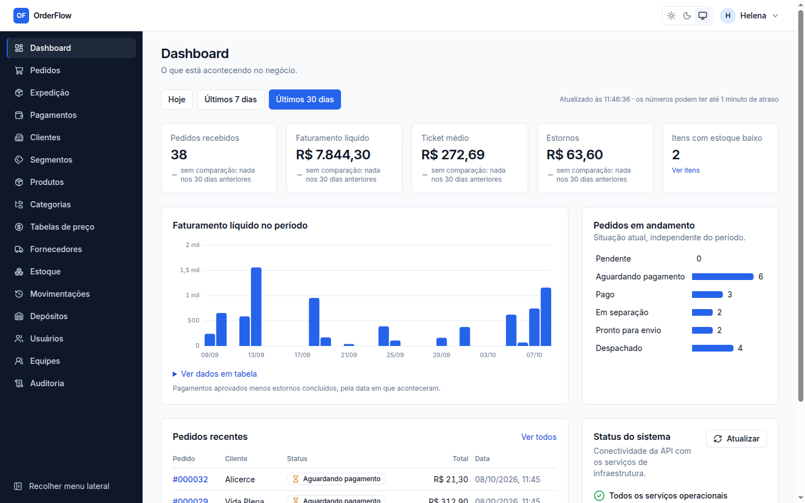

## O que o projeto demonstra

- **Nunca vender a última unidade duas vezes.** Reserva com lock pessimista ordenado por `id` (sem deadlock), `lock_timeout` com erro re-tentável e `available = on_hand - reserved` protegido também por `CHECK` no banco. Os testes de concorrência usam threads contra PostgreSQL real e foram validados por mutação: sem o lock, eles falham.
- **Máquina de estados explícita.** O pedido segue o caminho rascunho → pendente → aguardando pagamento → pago → em separação → pronto para envio → despachado → entregue. Cancelamento e estorno têm regras próprias. Toda transição passa pelo domínio e grava um histórico append-only, garantido por trigger.
- **Eventos que não se perdem.** O Transactional Outbox grava o evento na mesma transação da mudança, e a entrega é deduplicada por handler. Com o RabbitMQ bloqueado por disco cheio, nada se perdeu: o outbox entregou tudo quando o broker voltou.
- **Repetir é seguro.** `Idempotency-Key` persistida no PostgreSQL em `POST /orders`, pagamentos e estornos, inclusive na cobrança no gateway, que atravessa várias transações (registro `IN_PROGRESS` antes da chamada externa).
- **Falha parcial com saída.** Cobrança sem resposta do gateway é reconciliada com backoff. Aprovação que chega depois do cancelamento vira estorno automático. Reserva vencida volta para o estoque, e remessa é acompanhada pelo rastreio.
- **Multi-tenant de verdade.** Toda tabela de negócio herda `TenantScopedModel`, toda view usa queryset já escopado e a organização vem sempre do usuário autenticado. Um teste de arquitetura impede view sem escopo.
- **Segurança em camadas:**
  - JWT com access token só em memória e refresh em cookie HttpOnly com rotação e blacklist;
  - RBAC por permissões `recurso:ação` (seis papéis);
  - throttling em login, refresh e pedidos de senha;
  - dados pessoais mascarados em logs e telas.
- **Operação:**
  - métricas Prometheus com painéis no Grafana e alertas versionados como código;
  - tracing OpenTelemetry da requisição até o e-mail enviado pelo worker;
  - `request_id`/`correlation_id` em todo log, evento e registro de auditoria.
- **Qualidade:**
  - 630 testes de backend contra PostgreSQL real e 187 testes de frontend;
  - 26 contratos do `import-linter` vigiando as fronteiras entre módulos;
  - mutação manual em toda regra crítica;
  - E2E no navegador e Lighthouse (acessibilidade 100) a cada fase.

Desenvolvido com Claude Code e Context Engineering: veja [como](#context-engineering-e-desenvolvimento-assistido-por-ia).

## Arquitetura

Um deploy Django com **módulos de negócio isolados** ([ADR-001](docs/adr/001-modular-monolith.md)). Um módulo chama a camada `application` do módulo dono quando precisa da resposta para continuar, e reage a eventos do outbox quando só precisa saber que algo aconteceu.

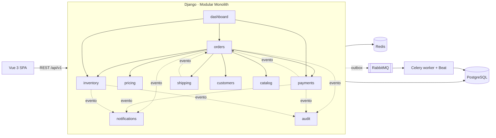

| Módulo | Responsabilidade |
| --- | --- |
| `identity` | Organizações (tenants), usuários, equipes, papéis e permissões, JWT, convite e redefinição de senha |
| `customers` | Clientes B2B, segmentos comerciais, endereços e contatos |
| `suppliers` | Fornecedores (CNPJ numérico e alfanumérico) |
| `catalog` | Produtos e categorias hierárquicas |
| `pricing` | Tabela padrão e tabelas por segmento; resolução do preço |
| `inventory` | Depósitos, saldo físico/reservado/disponível, reservas, ledger de movimentações, estoque baixo |
| `orders` | Ciclo de vida do pedido (máquina de estados) e coordenação do fluxo comercial |
| `payments` | Cartão via gateway (fake), baixa manual (PIX/boleto), estornos, reconciliação |
| `shipping` | Remessa, etiqueta e rastreio via transportadora (fake), entrega manual |
| `notifications` | E-mails a partir de eventos, com retry e histórico por pedido |
| `dashboard` | Indicadores somente leitura, com cache por TTL |
| `audit` | Trilha de auditoria append-only de pedidos, dinheiro e estoque |

Detalhes em [visão geral e roadmap](docs/architecture/overview.md), [modelo de domínio](docs/architecture/domain-model.md), [arquitetura orientada a eventos](docs/architecture/event-driven.md) e [diagramas C4](docs/diagrams/c4-model.md).

## Telas

| Pedidos | Detalhe do pedido |
| --- | --- |
| 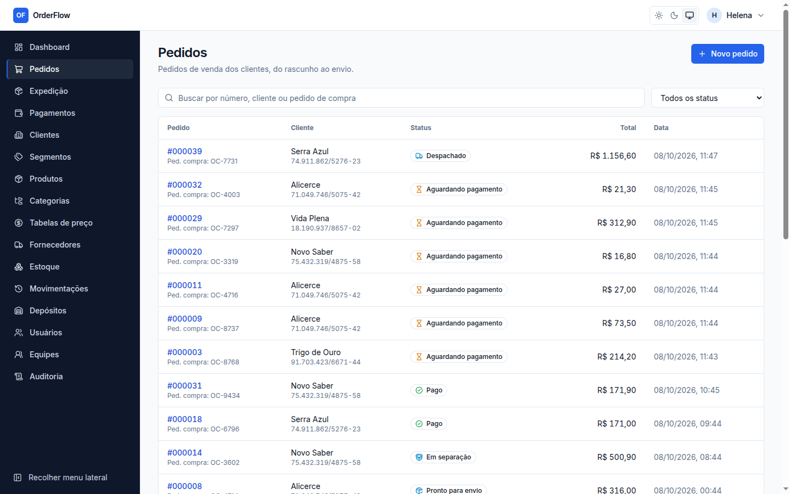 | 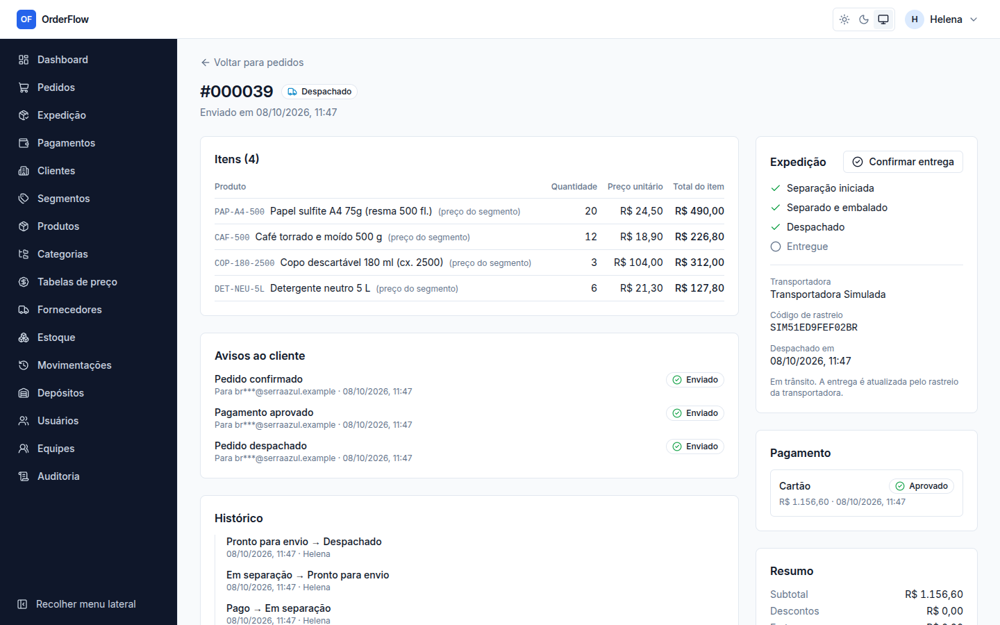 |

| Fila de expedição | Pagamentos e estornos |
| --- | --- |
| 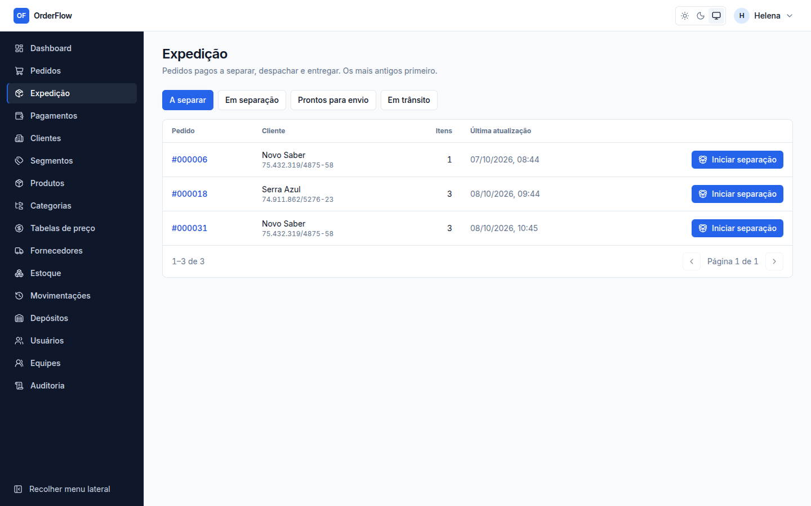 | 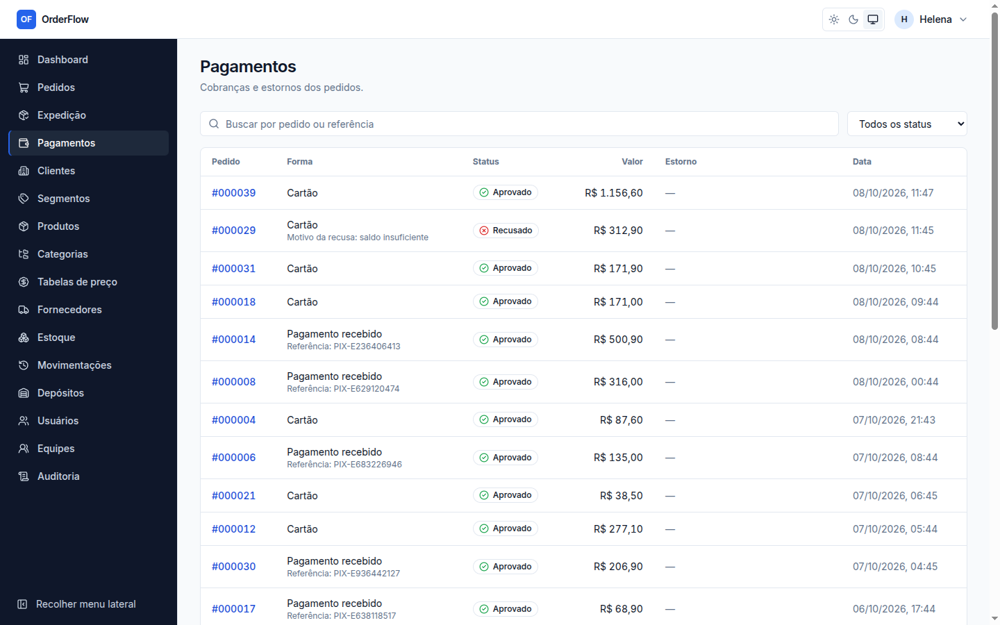 |

| Estoque por depósito | Trilha de auditoria |
| --- | --- |
| 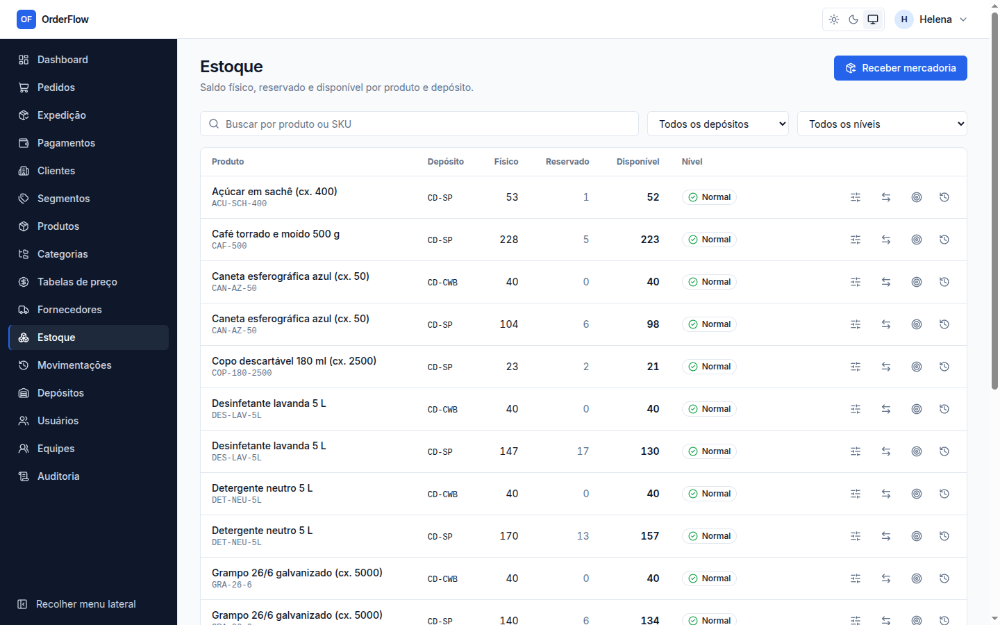 | 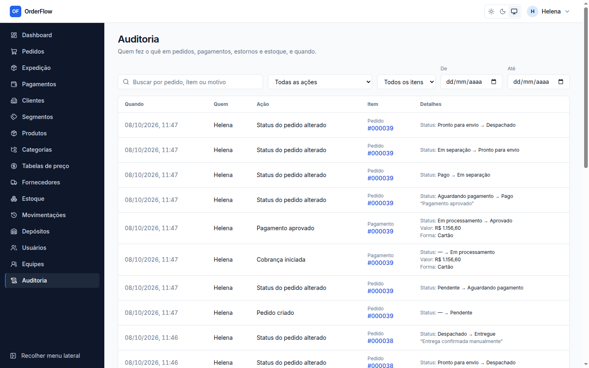 |

| Tema escuro | Celular |
| --- | --- |
| 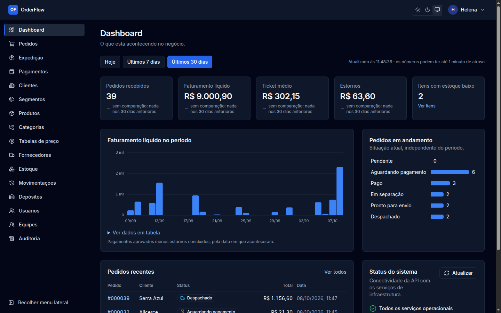 | 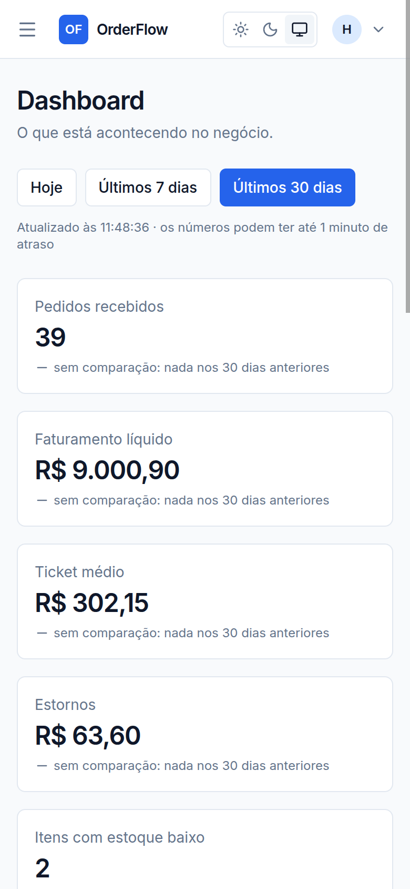 |

| Grafana | Jaeger: um pagamento atravessando API e worker |
| --- | --- |
| 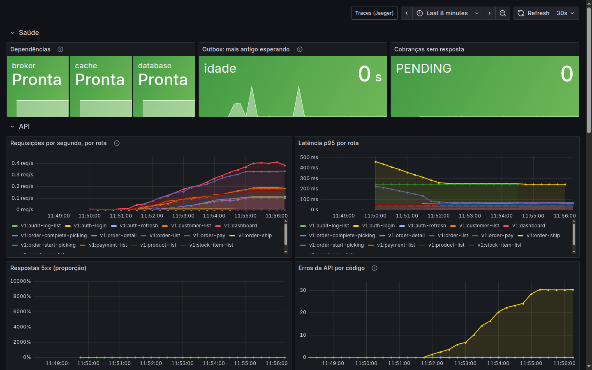 | 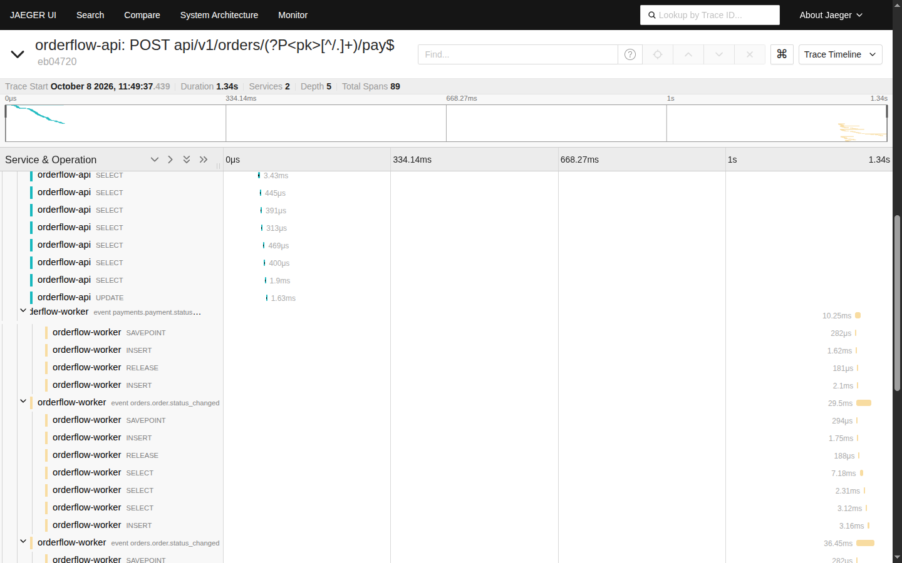 |

## Como executar

O guia completo, com o modo sem Docker, variáveis e problemas comuns, está em [docs/development/local-development.md](docs/development/local-development.md). Abaixo, o caminho mais curto do clone ao sistema funcionando.

### Pré-requisitos

| Ferramenta | Versão | Conferir |
| --- | --- | --- |
| Docker + Compose | v2 recente | `docker compose version` |
| moon (opcional) | v2 | `moon --version`. Só para lint, testes e build fora dos containers |

Portas usadas: 5173 (frontend), 8000 (API), 5432 (PostgreSQL), 6379 (Redis), 5672/15672 (RabbitMQ), 1025/8025 (Mailpit). No perfil de observabilidade também 3000 (Grafana), 9090 (Prometheus) e 16686 (Jaeger). Todas podem ser trocadas por variável (`POSTGRES_HOST_PORT`, `MAILPIT_UI_HOST_PORT`, ...).

### Primeira execução, passo a passo

#### 1. Subir o ambiente

```bash
git clone <url-do-repositório> order-flow && cd order-flow
docker compose up -d      # postgres, redis, rabbitmq, mailpit, backend, worker, beat, frontend
docker compose ps         # todos "running"/"healthy"
```

O Compose funciona **sem `.env`**: todos os valores têm defaults seguros só para desenvolvimento. Para trocar portas ou credenciais, use `cp .env.example .env`. O `.env` nunca vai para o Git. As migrations rodam sozinhas na subida do backend.

#### 2. Criar a primeira organização

Não há cadastro público de empresas: o operador da plataforma cria a organização e o primeiro ADMIN.

```bash
docker compose exec backend python manage.py create_organization \
  --name "Aurora Distribuidora" --admin-email helena@aurora.example --admin-first-name Helena
# a senha é pedida no terminal e passa pelos validadores do Django
```

#### 3. Testar pela interface

Entre em <http://localhost:5173> com o e-mail e a senha do passo 2.

| Experimente | Como |
| --- | --- |
| Montar o cadastro | Depósitos → Fornecedores → Categorias → Produtos → Tabelas de preço (padrão e por segmento) → Segmentos → Clientes (com endereço) |
| Colocar estoque | Estoque → "Receber mercadoria" |
| Fazer um pedido | Pedidos → "Novo pedido": o preço vem da tabela do segmento do cliente; "Salvar rascunho" ou "Enviar pedido" |
| Reservar e pagar | No pedido: "Reservar estoque" e depois "Pagar R$ … com cartão", escolhendo o cartão de teste; ou registre um pagamento recebido (PIX/boleto) com a referência |
| Ver uma recusa ou um timeout | Cartões de teste: aprovado, recusado (saldo insuficiente), timeout (cai na reconciliação), indisponível, estorno que falha |
| Separar e despachar | Expedição → "Iniciar separação" → "Concluir separação" → "Despachar". A entrega vem pelo rastreio simulado ou por confirmação manual |
| Cancelar um pedido pago | O estorno é pedido automaticamente; no pagamento manual, o financeiro confirma o estorno |
| Ver os e-mails | Mailpit em <http://localhost:8025>: pedido confirmado, pagamento aprovado, despachado, estoque baixo, convite |
| Convidar alguém | Usuários → "Novo usuário" → "Enviar convite por e-mail": o convite chega no Mailpit e a pessoa define a própria senha |
| Acompanhar o negócio | Dashboard (pedidos, funil, faturamento líquido, estoque baixo) e Auditoria (quem, o quê, quando) |
| Tema e celular | Seletor claro/escuro/sistema no topo; reduza a janela para ver o menu virar gaveta |

#### 4. Explorar a API

- OpenAPI (Swagger UI): <http://localhost:8000/api/docs/>; o schema fica em `/api/schema/`.
- Health: `/health/live` (processo) e `/health/ready` (banco, cache e broker).
- Erros sempre no envelope `{"error": {"code", "message", "details"}}`; toda resposta traz `X-Request-ID`.
- RabbitMQ management: <http://localhost:15672>.

#### 5. Parar

```bash
docker compose down        # para os containers; os dados ficam nos volumes
docker compose down -v     # também apaga os volumes (banco zerado)
```

### Testes automatizados

```bash
moon run :check            # lint + format-check + typecheck + testes de backend e frontend
moon run backend:test      # só o backend (precisa do PostgreSQL: docker compose up -d postgres)
moon ci                    # o que a CI roda: só as tarefas afetadas pela mudança
```

Sem o moon instalado, os mesmos comandos rodam dentro dos containers. Veja [backend/README.md](backend/README.md#como-rodar-testar-e-construir) e [frontend/README.md](frontend/README.md#como-rodar-testar-e-construir).

### Observabilidade (opcional)

```bash
OTEL_EXPORTER_OTLP_ENDPOINT=http://jaeger:4318 docker compose --profile observability up -d
```

- Grafana: <http://localhost:3000>, com o painel "OrderFlow — visão geral" (leitura sem login).
- Prometheus: <http://localhost:9090/alerts>, com as regras de alerta de `infra/observability/prometheus/alerts.yml`.
- Jaeger: <http://localhost:16686>. Busque `orderflow-api` → `POST .../pay` para ver a requisição, o outbox e o worker num trace só.

### Problemas comuns

| Sintoma | Solução |
| --- | --- |
| Porta em uso (5432, 6379, 8025...) | Troque a porta no `.env` (`POSTGRES_HOST_PORT=55432`, `REDIS_HOST_PORT`, `MAILPIT_UI_HOST_PORT`...) |
| Nenhum evento processado, nenhum e-mail sai | Alarme de disco do RabbitMQ: o `/health/ready` mostra `broker: unavailable`. Libere espaço; o outbox entrega o que ficou pendente |
| `celery-worker` reiniciando com `Connection reset by peer` | `docker compose restart rabbitmq` (metadados do broker inconsistentes depois de suspender a máquina) |
| Testes do backend com erro de conexão | `docker compose up -d postgres` |
| Volta para o login ao recarregar a página | Não deveria: o refresh token em cookie HttpOnly restaura a sessão. Confira se a API está no ar |

Mais casos em [local-development.md](docs/development/local-development.md#problemas-comuns).

## Stack

| Backend | Frontend | Infra e qualidade |
| --- | --- | --- |
| Python 3.13, Django 5.2 LTS, Django REST Framework, drf-spectacular (OpenAPI), SimpleJWT, Celery + Celery Beat, structlog, django-prometheus, OpenTelemetry | Vue 3 (`<script setup>`), TypeScript strict, Vite, Vue Router, Pinia, TanStack Query, Axios, Zod, vue-i18n, Tailwind CSS v4 (só tokens), Reka UI, Lucide | PostgreSQL 17, Redis 7, RabbitMQ 4, Mailpit, Docker Compose, Moonrepo v2, uv, pnpm, GitHub Actions, pytest + factory_boy, Vitest + Vue Test Utils, Ruff, mypy, import-linter, ESLint, Prettier, vue-tsc, Prometheus, Grafana, Jaeger |

Justificativas de cada escolha: [ADRs](docs/adr/README.md).

## Documentação

| Tema | Documento |
| --- | --- |
| Backend em detalhe | [backend/README.md](backend/README.md): módulos, camadas, consistência, eventos, segurança, testes e diferenciais |
| Frontend em detalhe | [frontend/README.md](frontend/README.md): organização por feature, estado, design system, acessibilidade, segurança e testes |
| Decisões (15 ADRs) | [adr/](docs/adr/README.md): Modular Monolith, PostgreSQL, Outbox, idempotência, concorrência de estoque, multi-tenancy, cache do dashboard, observabilidade... |
| Arquitetura | [overview e roadmap](docs/architecture/overview.md) · [backend](docs/architecture/backend.md) · [frontend](docs/architecture/frontend.md) · [monorepo](docs/architecture/monorepo.md) |
| Eventos e consistência | [event-driven](docs/architecture/event-driven.md) · [fluxos do pedido](docs/diagrams/order-flows.md) |
| Domínio | [regras por módulo](docs/domain/README.md) (fonte da verdade) · [glossário PT ↔ EN](docs/domain/glossary.md) · [pedidos](docs/domain/orders.md) · [estoque](docs/domain/inventory.md) · [pagamentos](docs/domain/payments.md) |
| Segurança e operação | [segurança](docs/architecture/security.md) · [observabilidade](docs/architecture/observability.md) |
| Desenvolvimento | [ambiente local](docs/development/local-development.md) · [padrões de código](docs/development/coding-standards.md) · [testes](docs/development/testing-strategy.md) · [git](docs/development/git-workflow.md) |
| Diagramas | [C4](docs/diagrams/c4-model.md) |

## Estrutura

```text
backend/    API Django + workers Celery: apps/ (12 módulos), shared/ (tenancy, eventos, idempotência, observabilidade...), config/ — detalhes em backend/README.md
frontend/   SPA Vue 3 + TypeScript: src/modules/ (uma pasta por feature), src/components/ui (design system), src/services/http — detalhes em frontend/README.md
infra/      Dockerfiles, nginx, Prometheus (scrape + alertas) e Grafana (painel provisionado)
docs/       arquitetura, ADRs, domínio, desenvolvimento, diagramas e as imagens deste README
.moon/      workspace e toolchains do Moonrepo
.github/    CI: moon ci com PostgreSQL de serviço
.claude/    rules, skills, commands, agents e templates (Context Engineering para o Claude Code)
```

## Context Engineering e desenvolvimento assistido por IA

O projeto foi desenvolvido com **AI-assisted development**, usando o [Claude Code](https://claude.com/claude-code) (Anthropic) como agente de programação, apoiado numa disciplina de **Context Engineering**. Em vez de pedidos soltos, o agente trabalha sobre um contexto projetado, versionado no repositório e carregado sob demanda: regras não negociáveis, arquitetura, linguagem ubíqua, regras de negócio por módulo, decisões (ADRs) e receitas de implementação.

O modelo é **human-in-the-loop**. O autor definiu objetivo, escopo, restrições e critérios de aceite. A cada fase, respondeu às decisões de produto em aberto (por exemplo: uma remessa por pedido? estorno parcial? quais eventos auditar?), aprovou a passagem para a seguinte e fez os commits. O agente executou modelagem, código, testes, revisões e documentação dentro desses limites.

### Arquitetura de contexto

| Camada | Artefato | Papel |
| --- | --- | --- |
| Contexto persistente (*project memory*) | [`CLAUDE.md`](CLAUDE.md) | Sempre ativo: fase atual, 12 regras não negociáveis (dinheiro em `Decimal`, `available = on_hand - reserved`, transições só pela máquina de estados, idempotência, envelope de erro...), princípios de design e Definition of Done |
| Regras por contexto | 13 arquivos em [`.claude/rules/`](.claude/rules) | Carregados conforme os arquivos tocados: arquitetura, idioma, segurança, banco, API, domínio, tarefas assíncronas, frontend, UI/acessibilidade, testes, DevOps, documentação |
| Conhecimento sob demanda (*progressive disclosure*) | 14 skills em [`.claude/skills/`](.claude/skills) | Receitas especializadas (`create-django-module`, `create-rest-endpoint`, `create-domain-event`, `create-celery-task`, `create-vue-feature`, `create-database-migration`, `write-integration-tests`, `review-security`, `create-adr`...) carregadas só quando a tarefa pede |
| Comandos de fluxo | 6 commands em [`.claude/commands/`](.claude/commands) | `/project-status`, `/create-module`, `/create-endpoint`, `/create-feature`, `/run-tests`, `/review-code` |
| Fonte de verdade do domínio | [docs/domain/](docs/domain/README.md) | Regras de negócio por módulo e glossário. Divergência entre código e documento é defeito de um dos dois |
| Registro de decisões | 15 [ADRs](docs/adr/README.md) | Decisões e alternativas descartadas, para que nenhuma sessão nova reabra o que já foi decidido |
| Estado e progresso | [roadmap](docs/architecture/overview.md#roadmap) e [histórico de testes](docs/development/testing-strategy.md#validar-que-o-teste-testa-mutação-manual) | Fase atual, entregas, bugs encontrados e lições: o ponto de retomada entre sessões |

### Fluxo de trabalho (*agentic workflow*)

- **Execução faseada com gate humano.** Foram 14 fases incrementais (0 a 13): fundação, identidade, cadastros, estoque, preços, pedidos, reserva, pagamentos, expedição, notificações, dashboard, auditoria e observabilidade. Uma fase só começa com pedido explícito e termina com um relatório de entregas, bugs, decisões e riscos.
- **Fluxo obrigatório por mudança:** ler o contexto → identificar o módulo → ler o documento de domínio e os ADRs → mapear impacto → planejar → implementar → testar → lint/typecheck → revisão de segurança → revisão de arquitetura.
- **Guardrails:**
  - "teste anti-overengineering" antes de qualquer interface, repository, factory ou evento: *qual problema concreto isto resolve agora?*;
  - nada de fase futura antecipada;
  - mudança de decisão registrada exige ADR;
  - sem commit sem pedido.
- **Verification loop.** Nenhum teste é dado como aprovado sem ter sido executado. Cada fase fecha com:
  - a suíte completa;
  - **mutação manual** de cada regra crítica (remover a regra tem que derrubar um teste);
  - E2E exploratório no navegador com worker e Beat reais;
  - Lighthouse.

### Multi-agent review

Mudanças em áreas sensíveis passam por **subagents revisores especializados** ([`.claude/agents/`](.claude/agents)), cada um num contexto isolado e sem permissão de edição:

| Agent | Escopo |
| --- | --- |
| `software-architect` | Fronteiras entre módulos, novas abstrações, necessidade de ADR, overengineering |
| `domain-reviewer` | Invariantes, transições de estado, regras duplicadas, domínio anêmico |
| `security-reviewer` | JWT, RBAC, IDOR, mass assignment, dados sensíveis em log, throttling |
| `database-engineer` | Migrations, índices, constraints, locks e isolamento |
| `code-reviewer` / `ux-reviewer` | Convenções e testes; feedback, estados vazios, acessibilidade e tokens |
| `backend-engineer`, `frontend-engineer`, `test-engineer`, `devops-engineer` | Implementação especializada por área |

Exemplos de defeitos encontrados por esse ciclo e corrigidos com teste:

- **Teste que não testava:** sem o lock dos itens, o teste da "última unidade" seguia verde, porque outro lock no caminho serializava a disputa. Ele foi reescrito para disputar pela reserva; agora, sem o lock, falha, e travar na ordem errada produz o deadlock esperado.
- **Integração real:** o header Celery `correlation_id` colidia com a propriedade AMQP que o Celery preenche com o id da task. O teste unitário simulava a mensagem sem ela; o E2E com worker real revelou.
- **Resiliência:** com o disco do host cheio, o RabbitMQ bloqueou publicações. O outbox segurou os eventos e entregou tudo depois, e virou alerta (`OrderflowDependencyDown`) e entrada no guia de problemas.
- **Acessibilidade:** a cor de status aplicada ao texto reprovava em contraste no Lighthouse. A cor passou a ficar só no ícone, com o texto em cor neutra.

O histórico completo, por fase, está na [estratégia de testes](docs/development/testing-strategy.md#validar-que-o-teste-testa-mutação-manual).

### Reprodutibilidade

O contexto é parte do repositório: abrir o projeto no Claude Code carrega automaticamente o `CLAUDE.md`, as rules, as skills e os agents. Uma nova sessão parte das mesmas regras, decisões e estado, sem depender do histórico de conversas.
