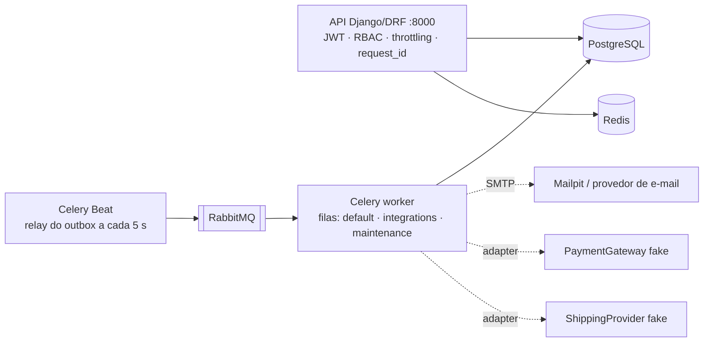
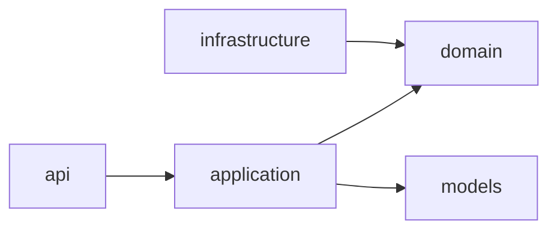
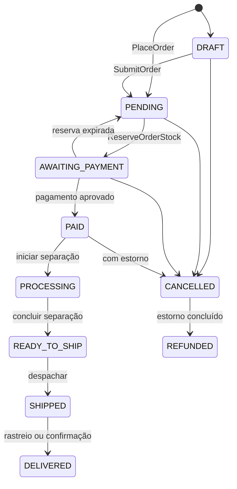

# Backend — OrderFlow

API REST em **Python 3.13 / Django 5.2 + Django REST Framework**, organizada como **Modular Monolith** de 12 módulos de negócio, e os workers **Celery** que entregam eventos do outbox, enviam e-mails, reconciliam pagamentos e rastreiam remessas. Este documento explica como o backend é organizado, as decisões de engenharia por trás dele e o que o diferencia de um CRUD.

> Visão do produto e execução: [README da raiz](../README.md) · Frontend: [frontend/README.md](../frontend/README.md) · Contexto para o agente de IA: [CLAUDE.md](../CLAUDE.md)

## Sumário

- [Visão geral](#visão-geral)
- [Estrutura](#estrutura)
- [Arquitetura de cada módulo](#arquitetura-de-cada-módulo)
- [Design do código: padrões e convenções](#design-do-código-padrões-e-convenções)
- [Consistência: estoque, pedidos e dinheiro](#consistência-estoque-pedidos-e-dinheiro)
- [Integração entre módulos](#integração-entre-módulos)
- [Segurança](#segurança)
- [Persistência](#persistência)
- [Resiliência e operação](#resiliência-e-operação)
- [Estratégia de testes](#estratégia-de-testes)
- [Diferenciais de engenharia](#diferenciais-de-engenharia)
- [Como rodar, testar e construir](#como-rodar-testar-e-construir)

## Visão geral



Um só deploy (`api` + `worker` + `beat` na mesma base de código) e um só banco. Cada módulo é dono das suas tabelas, e as fronteiras entre eles são verificadas por ferramenta ([ADR-001](../docs/adr/001-modular-monolith.md)).

| Módulo | Responsabilidade | Nunca faz |
| --- | --- | --- |
| `identity` | Organizações (tenants), usuários, equipes, papéis/permissões, JWT, convite e redefinição de senha | Regra de negócio de outro módulo |
| `customers` | Clientes B2B, segmentos, endereços (cobrança/entrega padrão), contatos | Conhecer catálogo ou estoque |
| `suppliers` | Fornecedores, CNPJ numérico e alfanumérico | Conhecer estoque ou clientes |
| `catalog` | Produtos (SKU, GTIN, unidade), categorias hierárquicas | Guardar preço ou saldo |
| `pricing` | Tabela padrão e por segmento; resolve o preço de um produto para um cliente | Ser conhecido por catálogo ou estoque |
| `inventory` | Depósitos, saldos, reservas, ledger imutável de movimentações, estoque baixo | Saber o que é um pedido |
| `orders` | Máquina de estados do pedido e coordenação do fluxo comercial | Ser importado por qualquer outro módulo |
| `payments` | Cobrança (gateway e baixa manual), estornos, reconciliação | Conhecer pedidos (recebe `order_id` opaco) |
| `shipping` | Remessa, etiqueta, rastreio, entrega manual | Conhecer pedidos (recebe `order_id` opaco) |
| `notifications` | E-mails a partir de eventos, com retry e histórico | Ser chamado diretamente (só reage a eventos) |
| `dashboard` | Indicadores somente leitura, com cache por TTL | Escrever em qualquer tabela |
| `audit` | Trilha append-only de pedidos, dinheiro e estoque | Ser chamado diretamente (só reage a eventos) |

Regras de negócio de cada módulo: [docs/domain/](../docs/domain/README.md). Fronteiras e dependências: [domain-model](../docs/architecture/domain-model.md).

## Estrutura

```text
backend/
├── pyproject.toml           # dependências (uv), Ruff, mypy, pytest e os 26 contratos do import-linter
├── moon.yml                 # tarefas: lint, format, typecheck, test, build, dev
├── config/                  # settings (base · local · test · production), urls, celery (filas e Beat), wsgi, gunicorn
├── apps/                    # 12 módulos de negócio, um Django app cada
├── shared/                  # código transversal, sem regra de nenhum módulo
└── tests/                   # testes de arquitetura (escopo multi-tenant) e do schema OpenAPI
```

**Regra do `shared/`:** só entra o que não conhece nenhum conceito de negócio. Se algo ali sabe o que é "pedido" ou "estoque", está no lugar errado. Um contrato do import-linter garante que `shared` não importa módulos.

| Pacote | O que faz |
| --- | --- |
| `tenancy` | `TenantScopedModel` e `TenantScopedQuerysetMixin`: todo dado de negócio escopado pela organização do usuário ([ADR-013](../docs/adr/013-multi-tenancy.md)) |
| `permissions` | `HasPermission("orders:create")`: autorização declarativa por `recurso:ação` |
| `exceptions` | `DomainError` com `code` estável e o handler que devolve todo erro no envelope `{"error": {"code", "message", "details"}}` |
| `events` | Transactional Outbox: `publish()` na transação, relay com `SKIP LOCKED`, entrega por handler com `ProcessedEvent` ([ADR-011](../docs/adr/011-transactional-outbox.md)) |
| `idempotency` | `@idempotent`: `Idempotency-Key` + impressão digital do corpo, persistidas no PostgreSQL ([ADR-012](../docs/adr/012-idempotency-keys.md)) |
| `logging` | structlog em JSON, `request_id`/`correlation_id` propagados até o worker, mascaramento de dados sensíveis |
| `observability` | Métricas Prometheus (inclusive multiprocesso), tracing OpenTelemetry, contexto nas tasks Celery ([ADR-015](../docs/adr/015-observability-stack.md)) |
| `infrastructure` | Health checks (`/health/live`, `/health/ready`), `lock_timeout` local, detecção de lock timeout |
| `domain`, `pagination`, `api`, `testing` | Validação de CNPJ/documentos, paginação, utilitários de API e fixtures de teste |

## Arquitetura de cada módulo

Camadas **somente quando a complexidade justifica**. Módulos com regra relevante (`identity`, `inventory`, `orders`, `payments`, `shipping`, `notifications`, `dashboard`, `audit`) usam:

```text
apps/<módulo>/
├── api/             serializers, views, permissions, urls          ← fino: valida formato, chama um use case
├── application/     commands (use cases), queries, transações       ← orquestra; único ponto de entrada externo
├── domain/          estados, políticas, eventos, exceções, portas   ← Python puro: sem DRF, SimpleJWT ou Celery
├── infrastructure/  adapters (gateway, transportadora), tasks Celery
├── models.py        persistência (Django ORM)
└── tests/
```



Módulos simples (`customers`, `suppliers`, `catalog`, `pricing`) continuam **Django idiomático**: `models.py`, `api/`, `services.py` e `selectors.py`. Nenhum diretório vazio para "parecer Clean Architecture".

As fronteiras são **fitness functions** executadas no lint (`lint-imports`), não convenção de boa vontade:

| Tipo de contrato | Exemplos (26 no total) |
| --- | --- |
| Camadas (`layers`) | `orders: api → application → domain`, o mesmo em payments, inventory, identity, notifications, dashboard, audit, shipping |
| Independência | "módulos não importam `api/` de outros módulos" |
| Proibição (`forbidden`) | "`orders` é o coordenador: ninguém depende dele"; "`payments` não conhece outros módulos de negócio"; "ninguém depende de `notifications`/`audit` (só reagem a eventos)"; "domínio puro: sem DRF, SimpleJWT ou Celery"; "`shared` não depende de módulos de negócio" |
| Leitura controlada | "`notifications`, `dashboard` e `audit` leem outros módulos só pela camada pública (`application`/`selectors`)" |

Além disso, `tests/architecture/test_tenant_scoping.py` percorre as rotas e falha se alguma view de negócio não usar queryset escopado pela organização.

## Design do código: padrões e convenções

### Padrões adotados e recusados

Todo padrão tem um problema declarado. Antes de criar interface, repository, factory, service ou evento, a pergunta é: *qual problema concreto isto resolve agora?*

| Padrão | Uso | Por quê |
| --- | --- | --- |
| State (tabela de transições) | `orders.domain` | Transições permitidas num só lugar, sempre com `OrderStatusHistory`; classes State completas seriam cerimônia |
| Strategy | `pricing` | Resolução de preço que varia por segmento |
| Adapter + porta (`Protocol`) | `PaymentGateway`, `ShippingProvider`, backend de e-mail | Integrações externas substituíveis; os fakes são determinísticos por token (`tok_approved`, `tok_declined`, `tok_timeout`...) |
| Transactional Outbox + Idempotent Consumer | `shared/events` | Elimina o dual-write banco × broker; reentrega não duplica efeito |
| Domain Events | `orders.order.status_changed`, `payments.payment.approved`, `inventory.stock.low`... | Efeitos secundários (e-mail, auditoria) fora do caso de uso que os causou |
| Use case por intenção | `PlaceOrder`, `ReserveOrderStock`, `PayOrder`, `CancelOrder`, `ShipOrder` | SRP: nada de `OrderService` que faz estoque, pagamento, e-mail e envio |
| **Repository genérico: recusado** | — | O ORM já é o repositório; só se justificaria com query complexa ou isolamento real |
| **Saga: recusada** | — | Num monólito com um banco, a transação local resolve; efeitos externos usam estado intermediário + reconciliação |
| **Cache de leitura geral: recusado** | — | Só o dashboard tem cache, e depois de medido ([ADR-014](../docs/adr/014-dashboard-aggregate-cache.md)) |

### Contrato de API

- REST em inglês sob `/api/v1/`; textos ao usuário em pt-BR. Dinheiro trafega como **string decimal** (`"1156.60"`), nunca `float`; datas ISO-8601 em UTC.
- **Erros sempre no envelope** `{"error": {"code", "message", "details"}}`, com `code` estável em inglês (72 códigos, por exemplo `INSUFFICIENT_STOCK`, `INVALID_STATUS_TRANSITION`, `IDEMPOTENCY_KEY_REUSED`). Nunca stack trace, SQL ou nome de tabela.
- Todo objeto é buscado por queryset **já escopado** (anti-IDOR): recurso de outra organização responde `404`.
- Serializers de escrita declaram campos explicitamente; `status`, `total`, `created_by` e `reserved` são somente leitura (anti mass assignment).
- OpenAPI gerado pelo drf-spectacular, com testes que garantem a geração do schema e a documentação do JWT e do `Idempotency-Key`.

### Contrato de eventos

- Nome `<módulo>.<agregado>.<fato>` (`payments.payment.approved`, `shipping.shipment.delivered`), payload com ids e valores, sem dado pessoal.
- Envelope com `event_id`, `event_name`, `version`, `occurred_at` e `payload`. O evento carrega o `request_id` de origem e o contexto do trace (`traceparent`), então o log e o trace continuam no worker.
- Catálogo e fluxos: [event-driven](../docs/architecture/event-driven.md) · [fluxos do pedido](../docs/diagrams/order-flows.md).

## Consistência: estoque, pedidos e dinheiro

**Estoque** ([ADR-008](../docs/adr/008-stock-concurrency-control.md), [inventory.md](../docs/domain/inventory.md)):

- `available = on_hand - reserved`, com `CHECK reserved <= on_hand` e saldos não negativos no banco.
- Reserva **tudo-ou-nada** com `SELECT … FOR UPDATE` nos itens **em ordem de `id`**, o que evita deadlock entre pedidos que disputam os mesmos produtos em ordens diferentes.
- `lock_timeout` local de 3 s: disputa longa vira `STOCK_BUSY` (re-tentável), não um request preso.
- Toda mudança de saldo grava um `StockMovement`; o ledger é **append-only por trigger**. A reserva expira em 48 h se o pagamento não vier.

**Pedido** ([orders.md](../docs/domain/orders.md)):



Preços são resolvidos por `pricing` e **congelados** no envio do pedido. Linhas são imutáveis a partir de `PENDING`. A numeração é sequencial por organização, com lock no contador. Toda transição grava `OrderStatusHistory` (append-only por trigger) e publica `orders.order.status_changed`.

**Idempotência** ([ADR-012](../docs/adr/012-idempotency-keys.md)):

| Camada | Chave | Efeito |
| --- | --- | --- |
| Cliente → API | `Idempotency-Key` + impressão digital do corpo, por usuário | Repetição devolve a mesma resposta; mesma chave com outro corpo → `IDEMPOTENCY_KEY_REUSED`; concorrente → `IDEMPOTENCY_REQUEST_IN_PROGRESS` |
| Cobrança no gateway | Registro `IN_PROGRESS` gravado **antes** da chamada externa; a chave vai ao provedor | Timeout no meio não gera segunda cobrança; a reconciliação consulta o provedor pela mesma chave |
| Evento → handler | `ProcessedEvent(event_id, handler)` na transação do efeito | Reentrega não duplica e-mail, auditoria nem transição |

**Dinheiro:** `Decimal`/`NUMERIC` de ponta a ponta. `UNIQUE` parciais garantem um pagamento aprovado por pedido, uma cobrança em andamento por pedido e um estorno ativo por pagamento. O faturamento do dashboard é "aprovados menos estornos concluídos", pela data em que aconteceram.

## Integração entre módulos

- **Chamada síncrona para perguntas, evento para fatos.** `orders` chama `inventory.application` para reservar e `payments.application` para cobrar, porque precisa da resposta para continuar. `notifications` e `audit` só reagem a eventos.
- **Nenhuma chamada externa com lock aberto.** A cobrança grava a intenção (TX1), chama o gateway fora da transação e aplica o resultado (TX2). O despacho pede a etiqueta fora do lock e re-checa o estado depois.
- **Outbox:** `publish()` grava `OutboxEvent` na transação da mudança. O Beat roda o relay a cada 5 s (`SELECT … FOR UPDATE SKIP LOCKED`, lotes de 100), que enfileira uma entrega **por handler**. A entrega usa `acks_late` e retry exponencial com jitter (até 8 novas tentativas). Eventos publicados são purgados depois de um prazo.

## Segurança

- **Autenticação:** SimpleJWT. O access token dura 10 min e o frontend o guarda só em memória; o refresh dura 7 dias, fica em cookie HttpOnly e tem **rotação + blacklist** ([ADR-007](../docs/adr/007-jwt-authentication.md)). Logout e redefinição de senha encerram as sessões.
- **Autorização:** RBAC com 6 papéis (`ADMIN`, `MANAGER`, `SALES`, `WAREHOUSE`, `FINANCE`, `VIEWER`) mapeados para permissões `recurso:ação` numa única política (`identity/domain/permissions.py`). Proibido `if user.role == ...` espalhado. A matriz de permissões é testada contra a documentação.
- **Multi-tenancy:** a organização vem sempre de `request.user`, nunca do corpo ou da URL.
- **Throttling:** login e refresh a 10/min por IP; pedidos de redefinição de senha a 5/h; limites gerais por usuário e anônimo.
- **Convite e redefinição:** token de uso único com validade, fora da URL de API; a resposta é a mesma para e-mail existente ou não.
- **Dados sensíveis:** nunca em log (senha, JWT, `Authorization`, cartão, secrets). E-mails mascarados nos logs e no histórico de avisos. O token do cartão não é persistido.
- `/metrics` protegido por token fora do ambiente local; segredos só por variável de ambiente.

Detalhes: [security.md](../docs/architecture/security.md).

## Persistência

- **PostgreSQL 17 como fonte da verdade** ([ADR-004](../docs/adr/004-postgresql.md)). Redis só para cache e throttling ([ADR-006](../docs/adr/006-redis.md)), nunca para estado de negócio.
- **O banco protege as invariantes:** 44 `CheckConstraint`, 28 `UniqueConstraint` (várias parciais, como um único pagamento `PENDING` por pedido), FKs e índices desenhados para as consultas reais.
- **Três tabelas append-only por trigger:** histórico de status do pedido, movimentações de estoque e trilha de auditoria. A auditoria só aceita `DELETE` pela rotina de retenção (5 anos), que liga a permissão com `set_config` dentro da própria transação.
- 19 migrations versionadas; `moon run backend:build` falha se algum model divergir delas (`makemigrations --check`).
- Transações explícitas nos use cases (`ATOMIC_REQUESTS` desligado).

## Resiliência e operação

| Falha | Comportamento |
| --- | --- |
| Gateway não responde (timeout) | Pagamento fica `PENDING`; a reconciliação consulta o provedor pela chave a cada minuto com backoff e aplica o resultado, ou `FAILED` se o provedor não conhece a cobrança |
| Aprovação chega depois do cancelamento | Estorno automático; o pedido segue cancelado |
| Cliente não paga | Reserva expira em 48 h; o estoque volta e o pedido volta a `PENDING` |
| RabbitMQ fora ou bloqueado | Eventos acumulam no outbox; `/health/ready` mostra `broker: unavailable` e o alerta `OrderflowDependencyDown` dispara; ao voltar, tudo é entregue |
| SMTP falha | Até 4 novas tentativas com backoff exponencial; depois `FAILED` no histórico do pedido; uma rotina reenfileira avisos parados |
| Disputa longa por estoque | `STOCK_BUSY` em até 3 s, re-tentável |

Tarefas agendadas (Celery Beat, filas separadas para integrações e manutenção):

- relay do outbox (5 s);
- reconciliação de pagamentos (60 s);
- rastreio de remessas (60 s);
- expiração de pedidos não pagos (60 s);
- reenfileiramento de e-mails parados (5 min);
- diárias: cancelamento de pedidos pendentes antigos, conferência do saldo contra o ledger, purga de eventos publicados e de registros de idempotência vencidos;
- mensal: retenção da auditoria.

**Observabilidade** ([ADR-015](../docs/adr/015-observability-stack.md), [observability.md](../docs/architecture/observability.md)):

- logs JSON (structlog) com `request_id`, `correlation_id` e `trace_id`;
- métricas Prometheus de HTTP, banco, outbox (pendentes, idade do mais antigo), entregas, pagamentos e e-mails, somadas entre os processos do gunicorn;
- tracing OpenTelemetry da requisição até o worker;
- regras de alerta versionadas e validadas com `promtool`.

## Estratégia de testes

**630 testes** (pytest + pytest-django + factory_boy), todos contra **PostgreSQL real**: locks, constraints e triggers fazem parte das regras e não existem no SQLite.

| Nível | Como |
| --- | --- |
| Domínio | Funções e políticas puras: transições, cálculo de totais, resolução de preço, regras de permissão |
| Integração | Use cases e API com banco real; caminhos de erro e envelope de erro conferidos por `code` |
| Concorrência (`@pytest.mark.concurrency`) | Threads com `transaction=True` e barreiras: última unidade disputada, reservas cruzadas sem deadlock, último ADMIN, numeração de pedidos, despacho duplo, idempotência simultânea |
| Arquitetura | 26 contratos do import-linter + escopo multi-tenant de todas as views + geração do schema OpenAPI |
| Mutação manual | Cada regra crítica foi removida de propósito para confirmar que um teste falha (Phases 2 a 13: dezenas de mutações, todas detectadas; as que passaram na primeira rodada viraram testes melhores) |
| Integração real | E2E a cada fase com worker, Beat, RabbitMQ e Mailpit reais |

Fakes determinísticos substituem serviços externos: `FakePaymentGateway`, `FakeShippingProvider` e e-mail em memória. Cenários obrigatórios e o histórico de mutação: [testing-strategy](../docs/development/testing-strategy.md).

## Diferenciais de engenharia

1. **Monólito modular com fronteiras verificadas.** Um deploy simples de operar, com a disciplina de módulos independentes garantida por 26 contratos que falham o lint, não por revisão manual.
2. **Propriedades provadas, não afirmadas.** Concorrência, idempotência e regras de estado têm testes de disputa real, validados por mutação. Quando um teste passou sem a regra, ele foi reescrito até falhar.
3. **Defesa em profundidade nos dados.** As regras vivem no domínio **e** em constraints e triggers do PostgreSQL; um bug numa camada não corrompe estoque, histórico ou auditoria.
4. **Falha parcial como caso de uso.** Toda integração externa tem estado intermediário seguro e um caminho de recuperação: reconciliação, expiração, outbox, retry com histórico.
5. **Decisões medidas.** O cache do dashboard veio depois de medir 500 mil pedidos (índices: de ~220 ms para ~35–60 ms; cache de 60 s limita a carga simultânea).
6. **Simplicidade deliberada.** Sem repository genérico, sem Saga, sem interface com uma implementação só. Módulos simples continuam Django puro.
7. **Rastreabilidade ponta a ponta.** Do `X-Request-ID` da resposta ao log do worker, ao trace no Jaeger e ao registro de auditoria com antes/depois.
8. **Engenharia assistida por IA com Context Engineering.** Desenvolvido com Claude Code sobre contexto versionado (`CLAUDE.md`, rules por área, skills, ADRs) e revisões por subagents especializados ([detalhes](../README.md#context-engineering-e-desenvolvimento-assistido-por-ia)).

## Como rodar, testar e construir

Pelo Docker Compose da raiz (recomendado): o código é montado no container e recarrega sozinho; as dependências ficam em `/opt/venv`.

```bash
docker compose up -d
docker compose exec backend python manage.py create_organization --name "Acme" --admin-email ana@acme.example
docker compose exec backend python manage.py shell
docker compose exec backend pytest -q                      # testes, usando o PostgreSQL do Compose
docker compose exec backend ruff check . && docker compose exec backend lint-imports
```

Com moon e uv no host (precisa de PostgreSQL, Redis e RabbitMQ no ar: `docker compose up -d postgres redis rabbitmq`):

```bash
moon run backend:check       # ruff + import-linter + format-check + mypy + pytest
moon run backend:test        # só os testes (DATABASE_URL aponta para o PostgreSQL)
moon run backend:build       # manage.py check + migrations sincronizadas com os models
moon run backend:dev         # runserver em :8000

uv sync                      # cria o .venv; depois: uv run pytest -m concurrency
```

- Configuração por variáveis de ambiente (modelo em [../.env.example](../.env.example)); `DJANGO_SETTINGS_MODULE` escolhe `config.settings.local`, `test` ou `production`.
- Produção: gunicorn (`config/gunicorn.conf.py`) com métricas multiprocesso; worker e Beat como processos separados.
- OpenAPI: <http://localhost:8000/api/docs/> · health: `/health/ready` · métricas: `/metrics`.
- Novo módulo, endpoint, evento ou task: skills em [`.claude/skills/`](../.claude/skills) e convenções em [coding-standards](../docs/development/coding-standards.md).
