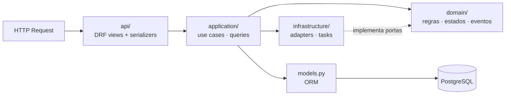

# Backend

Stack: Python 3.13 · Django 5.2 LTS · DRF · drf-spectacular · SimpleJWT · django-filter · Celery ·
PostgreSQL · Redis · RabbitMQ. Decisões: ADR-001, 002, 004, 005, 006, 007.

## Estrutura

```text
backend/
├── config/                 # projeto Django
│   ├── settings/
│   │   ├── base.py
│   │   ├── local.py
│   │   ├── test.py
│   │   └── production.py
│   ├── urls.py             # /api/v1/, /api/schema/, /api/docs/, /health/
│   ├── celery.py           # app Celery, filas, beat schedule
│   ├── asgi.py
│   └── wsgi.py
├── apps/                   # módulos de negócio (Django apps)
│   ├── identity/  customers/  suppliers/  catalog/  inventory/  orders/
│   └── pricing/   payments/   shipping/   notifications/  audit/
├── shared/                 # transversal, sem regra de negócio de módulo
│   ├── domain/             # Money, tipos base
│   ├── events/             # DomainEvent, publish, subscribe, dispatcher
│   ├── exceptions/         # DomainError + exception handler da API
│   ├── permissions/        # HasPermission("resource:action")
│   ├── pagination/
│   ├── idempotency/        # ADR-012
│   ├── logging/            # structlog, middleware de request_id
│   └── infrastructure/     # health checks, utilitários de DB
├── tests/                  # testes transversais (arquitetura, contratos, e2e de API)
├── conftest.py
├── manage.py
├── pyproject.toml          # deps, ruff, mypy, pytest, import-linter
├── uv.lock
└── moon.yml
```

Diretórios de `shared/` são criados quando o primeiro uso real aparece: a Phase 1 criou
`exceptions`, `pagination`, `logging` e `infrastructure` (health); a Phase 2 criou `tenancy`
(ADR-013) e `permissions`; a Phase 3 criou `domain` (CNPJ, GTIN), `api` (ações
activate/deactivate) e `infrastructure/db.py` (nome da constraint violada); `events` e `idempotency`
chegam com as fases que os usam.

**Módulos da Phase 3:** `suppliers` e `catalog` usam o nível 1 do template (`models`, `services`,
`selectors`, `exceptions`, `api/`): as regras cabem em serviços coesos e não justificam camadas
`application/`/`domain/` próprias. Leituras com regra que outros módulos usam ficam em
`selectors.py` (ex.: `get_active_supplier`), nunca em consultas diretas ao model alheio.

**Permissões de leitura/escrita:** `HasReadWritePermission(read=..., write=...)` aplica `read` em
métodos seguros e `write` nos demais.

**Erros de unicidade:** `shared.infrastructure.db.violated_constraint(exc)` lê o nome da constraint
informado pelo PostgreSQL para traduzir cada `UNIQUE` no erro de domínio certo (sem depender do texto
da mensagem).

**Exceção deliberada na Phase 1:** `apps/identity` já contém o model `User` (UUID como PK, e-mail
único) e `AUTH_USER_MODEL = "identity.User"`. Trocar o modelo de usuário depois do primeiro
`migrate` exige reescrever as migrations de `auth`/`admin`; por isso ele nasce junto com o projeto.
O restante de identity (roles, permissões, JWT) é Phase 2.

## Camadas



| Camada | Faz | Não faz |
| --- | --- | --- |
| `api/` | autenticação, permissão, parse/validação de formato, chamar use case, serializar saída, status HTTP | regra de negócio, transação, query complexa |
| `application/` | orquestrar o caso de uso, abrir transação, carregar/persistir, chamar outros módulos, publicar eventos | decidir regras (delega ao domínio) |
| `domain/` | invariantes, políticas, cálculos, transições de estado, eventos, exceções | I/O, ORM queries, HTTP, Celery |
| `infrastructure/` | adapters de integrações, tasks Celery, repositories quando justificados | regra de negócio |

**Módulos simples** (ex.: `suppliers`) usam o nível 1 do template (`models.py`, `services.py`,
`selectors.py`, `api/`). A estrutura acompanha a complexidade real
(template: `.claude/templates/django-module.md`).

### Exemplo: `PlaceOrder`

```text
POST /api/v1/orders
  → OrderViewSet.create         valida formato, exige Idempotency-Key, checa orders:create
  → PlaceOrder.execute(cmd)     transaction.atomic()
      → customers: get_active_customer
      → catalog:   get_sellable_products
      → pricing:   price_lines(customer, lines)     Strategy por segmento/contrato
      → Order.place(...)        domínio valida invariantes O1–O8
      → inventory: ReserveStock (lock ordenado, ADR-008)
      → OrderStateMachine: PENDING → AWAITING_PAYMENT
      → publish(OrderCreated, StockReserved)        despacho após commit
  ← 201 Created
```

## Patterns e onde se aplicam

| Pattern | Onde | Problema resolvido |
| --- | --- | --- |
| Strategy | `pricing` (`PricingStrategy`: Standard/Wholesale/Contract), descontos, frete | Regras comerciais variam por cliente/contrato sem `if/elif` crescente |
| State (tabela de transições) | `orders` (`OrderStateMachine`), reservas, pagamentos | Impedir transições inválidas de forma declarativa e testável |
| Adapter + Port (`Protocol`) | `PaymentGateway`, `ShippingProvider`, `EmailProvider` | Isolar integrações; testar com fakes (`FakePaymentGateway`, `FakeShippingProvider`, `ConsoleEmailProvider`) |
| Observer / Domain Events | `shared/events` | Desacoplar efeitos secundários (auditoria, notificações) do caso de uso |
| Repository | somente com ganho real (ex.: queries de relatório complexas) | Isolar consultas complexas; **não** criar por model |
| Specification | candidatos: elegibilidade a desconto, filtros de estoque baixo | Regras combináveis reutilizadas em domínio e query — só se surgir duplicação real |
| Factory | criação de adapters por configuração (`get_payment_gateway()`) | Escolher implementação por ambiente sem `if` espalhado |

## Padrões de API

- Base `/api/v1/`; OpenAPI em `/api/schema/`, Swagger UI em `/api/docs/`.
- Ações de domínio explícitas: `POST /api/v1/orders/{id}/cancel`, `/pay`, `/ship`.
- Paginação padrão `PageNumberPagination` com `page_size` (padrão 25, máx. 100) e resposta:

```json
{ "count": 132, "next": "...", "previous": null, "results": [ ... ] }
```

- Filtros via django-filter; `search` e `ordering` em whitelist por endpoint.
- Datas em ISO 8601 UTC (`2026-10-04T13:45:00Z`); dinheiro como **string decimal** (`"1234.50"`)
  para não perder precisão em JSON; moeda explícita quando relevante.

### Envelope de erro

```json
{
  "error": {
    "code": "INSUFFICIENT_STOCK",
    "message": "Estoque insuficiente.",
    "details": { "lines": [{ "product_id": "…", "requested": 3, "available": 1 }] }
  }
}
```

- Um exception handler global (`shared/exceptions`) converte: `DomainError` → status/código
  definidos na exceção; `ValidationError` do DRF → `400 VALIDATION_ERROR` com `details.fields`;
  `NotAuthenticated` → `401 NOT_AUTHENTICATED`; `PermissionDenied` → `403 PERMISSION_DENIED`;
  `Http404` → `404 NOT_FOUND`; `Throttled` → `429 RATE_LIMITED`; qualquer outra → `500
  INTERNAL_ERROR` com mensagem genérica (detalhes só no log, com `request_id`).
- Toda resposta de erro inclui o header `X-Request-ID` para correlação com logs.
- `handler400/403/404/500` do Django também devolvem o envelope JSON, cobrindo requisições que
  não chegam a uma view DRF (rota inexistente, `Host` inválido). Com `DEBUG=True` o Django mostra
  as páginas de debug em HTML, como esperado em desenvolvimento.

## Transações

- `transaction.atomic()` no use case. `ATOMIC_REQUESTS` **desligado** (transações explícitas e curtas).
- Nada de I/O externo dentro de transação com locks.
- Efeitos pós-commit via `transaction.on_commit` (ou outbox, ADR-011).
- Saldo de estoque só muda pelo ledger de `inventory` (`application/ledger.py`), que fixa a ordem
  de locks e grava saldo e `StockMovement` na mesma transação (ADR-008).

## Celery

- `config/celery.py`: broker RabbitMQ, filas `default`, `notifications`, `integrations`,
  `maintenance`; `task_ignore_result=True`; `task_acks_late` por task; serializer JSON.
- Beat (MVP): `orders.expire_unpaid_orders` (1 min), `orders.cancel_stale_pending_orders` (1 h),
  `identity.flush_expired_tokens` (diário), `shared.cleanup_idempotency_records` (diário),
  `inventory.reconcile_stock` (diário).
- Políticas: [event-driven.md](event-driven.md) e `.claude/rules/async-tasks.md`.

## Configuração

- Settings por ambiente em `config/settings/`, valores lidos de variáveis de ambiente
  (`.env` local, nunca versionado; `.env.example` documenta todas as variáveis).
- `USE_TZ = True`, `TIME_ZONE = "UTC"`; `LANGUAGE_CODE = "pt-br"`.
- Feature flags: não há plataforma no MVP; flags simples por variável de ambiente lidas em um único
  módulo (`config/settings`) quando necessário.

## Tooling Python

| Ferramenta | Papel | Por quê |
| --- | --- | --- |
| uv | dependências, lockfile, venv, versão do Python | rápido, um binário, lockfile reprodutível |
| Ruff | lint **e** formatação | substitui flake8 + isort + Black com uma ferramenta; sem redundância |
| mypy + django-stubs + djangorestframework-stubs | type-check | detectar erros de contrato entre camadas |
| pytest + pytest-django + factory_boy + Faker | testes | padrão de mercado, fixtures expressivas |
| import-linter | fronteiras entre módulos e camadas | transforma a regra de arquitetura em verificação automática |
| pre-commit | ganchos locais (ruff, formatação, checagens rápidas) | feedback antes do commit |

Detalhes de estilo: [../development/coding-standards.md](../development/coding-standards.md).
