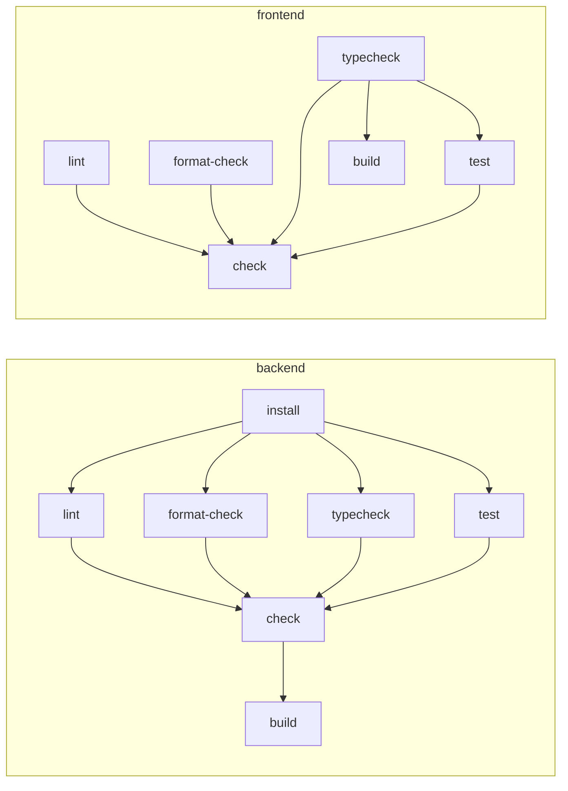

# Monorepo: Moonrepo, Docker Compose e Makefile

Decisões: [ADR-009](../adr/009-moonrepo.md) (Moonrepo) e
[ADR-010](../adr/010-docker-compose-local-environment.md) (Docker Compose).

## Divisão de responsabilidades

```text
                Developer / CI
                      │
        ┌─────────────┼──────────────┐
        ▼             ▼              ▼
     Makefile      Moonrepo     Docker Compose
   (atalhos finos) (tarefas de   (runtime e
        │          engenharia)    infraestrutura)
        └──► delega ──┘              │
                      │              │
           ┌──────────┴───┐   ┌──────┼────────┬──────────┬───────────────┐
           ▼              ▼   ▼      ▼        ▼          ▼               ▼
        backend       frontend  postgres  redis  rabbitmq  backend/frontend  celery-worker/beat
     lint·test·...   lint·test·...
```

| Ferramenta | Responsável por | Não faz |
| --- | --- | --- |
| Moonrepo | lint, format, typecheck, test, build, cache de tarefas, CI seletiva, versões de Node/pnpm | subir banco, broker, containers |
| Docker Compose | PostgreSQL, Redis, RabbitMQ, backend, frontend, Celery worker/beat, Flower | lint/test/build |
| Makefile | atalhos de DX (`make dev`, `make check`) | lógica própria; só delega |
| uv / pnpm | dependências de cada stack | coordenação entre projetos |

## Versão e arquivos do Moonrepo

O projeto usa **moon v2** (validado contra a documentação oficial em 2026-10, versão 2.5.x).
Mudanças relevantes em relação ao v1 que afetam este repositório:

| v1 | v2 (usado aqui) |
| --- | --- |
| `.moon/toolchain.yml` | `.moon/toolchains.yml` |
| `python:` no toolchain | `unstable_python` / `unstable_uv` (experimental — **não usamos**) |
| `tasks.*.platform` / `toolchain` | `tasks.*.toolchains`, `toolchains.default` no projeto |
| `inferInputs: true` | `inferInputs: false` (inputs explícitos obrigatórios para cache correto) |
| `tasks.*.local: true` | `tasks.*.preset: 'server'` |
| `moon run test` encontra o projeto mais próximo | usar `~:test` para isso |

Arquivos:

| Arquivo | Conteúdo |
| --- | --- |
| `.prototools` | versão do moon (2.5.6), lida pelo `proto install` e pela CI |
| `.moon/workspace.yml` | projetos `backend`/`frontend`, VCS `git`/`master`, `versionConstraint` |
| `.moon/toolchains.yml` | `javascript` (pnpm), `node`, `pnpm` com versões fixadas |
| [`backend/moon.yml`](../../backend/moon.yml) | tarefas Python via `uv` (toolchain `system`) |
| [`frontend/moon.yml`](../../frontend/moon.yml) | tarefas TypeScript/Vue (toolchains `javascript`/`node`/`pnpm` detectados) |

Esquemas JSON para validação no editor: `moon sync config-schemas` gera `.moon/cache/schemas/`
(referenciados por `$schema` no topo de cada arquivo).

## Tarefas padronizadas

| Tarefa | Backend | Frontend | Cache | CI |
| --- | --- | --- | --- | --- |
| `install` | `uv sync --locked` | (automático pelo toolchain JS) | não | sim |
| `lint` | `ruff check` + `lint-imports` | `eslint` | sim | sim |
| `format` | `ruff format` | `prettier --write` | não | não |
| `format-check` | `ruff format --check` | `prettier --check` | sim | sim |
| `typecheck` | `mypy` | `vue-tsc --build` | sim | sim |
| `test` | `pytest` | `vitest run` | sim | sim |
| `check` | agrega lint, format-check, typecheck, test | idem | — | sim |
| `build` | `manage.py check` + migrations sincronizadas (após `check`) | `vite build` (após `typecheck`) | sim | sim |
| `dev` | `runserver` | `vite` | não (`server`) | não |

Comandos globais:

```bash
moon run :lint          # lint em todos os projetos que têm a tarefa
moon run :typecheck
moon run :test
moon run :check         # tudo
moon run :build
moon run backend:test   # um projeto
moon run :test --affected   # só projetos afetados pelas mudanças locais
moon ci                 # CI: afetados + runInCI, continua após falhas e gera relatório
```

### Grafo de dependências entre tarefas



`frontend:test` depende de `typecheck` (erros de tipo falham antes e mais barato que os testes).
`backend:build` depende de `backend:check` (não "empacotamos" backend que não passou nas verificações).

## Notas de implementação das tarefas

Os arquivos `moon.yml` são a fonte da verdade; pontos não óbvios:

- **`check` usa `echo`**: a documentação do moon v2 não prevê tarefa sem comando; a tarefa existe
  para agregar `deps` sob um nome único.
- **Backend usa `uv run --no-sync`**: a sincronização do ambiente acontece uma vez em
  `backend:install` (`uv sync --locked`, sem cache); as demais tarefas não repetem esse trabalho.
- **`backend:build`** roda `manage.py check` e `makemigrations --check --dry-run`: o backend é
  "implantável" quando os system checks passam e não há migration pendente. O artefato de deploy
  (imagem Docker) é construído em job próprio da CI.
- **`backend:test` depende de PostgreSQL** (serviço externo ao moon): localmente via Docker
  Compose, na CI via service container. Como o banco não é input da tarefa, o cache do moon pode
  pular a suíte se o código não mudou — use `moon run backend:test --force` para forçar.
- **Frontend instala dependências automaticamente** pelo toolchain JavaScript (`pnpm install` no
  projeto, que não tem `package.json` na raiz do repositório).

### Validação (Phase 1)

Executado com moon 2.5.6 no repositório real: `moon run :check :build` → 13 tarefas verdes;
segunda execução 10/13 do cache em ~120 ms; `moon ci` → 17 ações aprovadas.

## pnpm e políticas de supply chain

O pnpm 12 vem com duas proteções ativas por padrão, mantidas no projeto:

- **Scripts de build de dependências bloqueados**: cada exceção é declarada em
  `frontend/pnpm-workspace.yaml` (`allowBuilds`). Hoje só `vue-demi: false` (script desnecessário
  com Vue 3).
- **`minimumReleaseAge`**: versões publicadas há menos de um dia são rejeitadas. Se um
  `pnpm add` falhar por isso, escolha a versão anterior em vez de criar exceção.

## CI (GitHub Actions)

Workflow: [`.github/workflows/ci.yml`](../../.github/workflows/ci.yml).

| Job | O que faz |
| --- | --- |
| `checks` | checkout com `fetch-depth: 0` → `astral-sh/setup-uv` → `moonrepo/setup-toolchain` (moon do `.prototools`) → `moon ci`; PostgreSQL como service container |
| `docker` | build das imagens de produção do backend e do frontend (valida os Dockerfiles) |

- `moon ci` executa apenas tarefas **afetadas** pelas mudanças e respeita `runInCI` (`format` e
  `dev` ficam fora). Mudança só no frontend não executa tarefas do backend.
- Confiabilidade acima de otimização: um agendamento diário roda `moon run :check :build`
  completo, sem filtro de afetados.
- O relatório do moon (`.moon/cache/*Report.json`) é publicado como artifact.
- Cache remoto de tarefas do moon (`remote` no workspace) é evolução futura.

## Docker Compose

Arquivo: [`docker-compose.yml`](../../docker-compose.yml). Dockerfiles em `infra/docker/`
(contexto de build = raiz do repositório, filtrado por `.dockerignore`).

| Serviço | Imagem | Observações |
| --- | --- | --- |
| `postgres` | `postgres:17-alpine` | volume `postgres-data`, healthcheck `pg_isready` |
| `redis` | `redis:7.4-alpine` | healthcheck `redis-cli ping` |
| `rabbitmq` | `rabbitmq:4.1-management-alpine` | UI em `:15672`, healthcheck `rabbitmq-diagnostics ping` |
| `backend` | `backend.Dockerfile` (target `dev`) | `migrate` + `runserver`; healthcheck em `/health/live` |
| `celery-worker` | mesma imagem | filas `default,notifications,integrations,maintenance`; healthcheck `celery inspect ping` |
| `celery-beat` | mesma imagem | schedule em `/tmp` (o usuário do container não escreve no código montado) |
| `frontend` | `frontend.Dockerfile` (target `dev`) | Vite com proxy de `/api` e `/health` para `backend:8000` |
| `flower` | mesma imagem do backend | opcional: `docker compose --profile tools up flower` |

- Funciona **sem `.env`** (defaults locais). Portas do host configuráveis via `.env`
  (`POSTGRES_HOST_PORT`, `BACKEND_HOST_PORT`...), úteis quando 5432/6379 já estão em uso.
- Imagens próprias rodam com usuário não-root; dependências Python ficam em `/opt/venv` (fora do
  volume do código), então comandos no container usam `python manage.py ...` diretamente.
- Target `production`: backend com gunicorn e só dependências de runtime; frontend estático no
  nginx (`infra/docker/nginx.conf`) com fallback de SPA.

## Makefile

Arquivo: [`Makefile`](../../Makefile). `make help` lista os alvos. Cada alvo é uma linha que delega
para `moon run :<tarefa>` ou `docker compose ...` — nenhuma lógica de pipeline vive nele.
