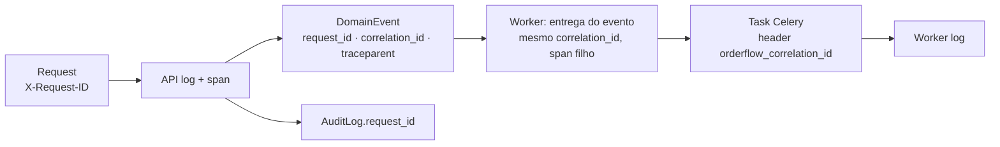

# Observabilidade

Objetivo: dado um problema relatado ("o pedido OF-2026-000123 não foi confirmado"), conseguir
reconstruir o que aconteceu — requisição, use case, eventos, tasks — sem acesso a debugger.

## Logs estruturados

- `structlog` configurado em `shared/logging`, saída **JSON** (console legível em `local`).
- Nome do evento de log: `module.entity.action` (`orders.order.created`,
  `inventory.reservation.expired`, `payments.gateway.timeout`).
- Contexto como chaves, nunca interpolado em texto.

```json
{
  "timestamp": "2026-10-04T13:45:00.123Z",
  "level": "info",
  "service": "orderflow-api",
  "environment": "local",
  "request_id": "7f3c…",
  "correlation_id": "7f3c…",
  "user_id": "…",
  "event": "orders.order.created",
  "order_id": "…",
  "order_number": "OF-2026-000123",
  "total": "1234.50"
}
```

| Nível | Uso |
| --- | --- |
| `debug` | detalhes de desenvolvimento (desligado em produção) |
| `info` | fatos de negócio e marcos (`order.created`, `payment.approved`) |
| `warning` | situação anormal tratada (`stock.busy`, retry de integração) |
| `error` | falha que exigiu interrupção (falha permanente, 500) |

**Nunca logar**: senha, JWT, refresh token, `Authorization`, cartão, secrets, payload completo de
requisições. Um processador remove chaves sensíveis conhecidas (`password`, `token`, `authorization`,
`secret`, `card_*`) como rede de segurança.

## Request ID e Correlation ID

- Middleware gera `request_id` (UUID) por requisição — ou aceita `X-Request-ID` do cliente se
  válido — e devolve no header de resposta.
- `correlation_id` acompanha o fluxo inteiro (Phase 13, ADR-015):
  - todo `DomainEvent` leva `request_id`, `correlation_id` e `trace_context` (W3C `traceparent`);
  - a entrega do evento (`shared.events.bus.deliver`) religa os dois ids no contexto dos logs e
    abre um span filho do trace da origem;
  - tasks Celery levam o id no header `orderflow_correlation_id` (`before_task_publish`) e o
    worker o religa no `task_prerun` (com `task_id` e `task_name`). Não pode ser
    `correlation_id`: o Celery usa essa propriedade AMQP para o id da própria task.
- Com tracing ligado, todo log tem `trace_id`/`span_id`: do log se chega ao trace no Jaeger.
- `AuditLog.request_id` liga auditoria a logs e traces.



## Health checks

| Endpoint | Tipo | Verifica | Uso |
| --- | --- | --- | --- |
| `GET /health/live` | liveness | processo responde (sem dependências) | reiniciar container travado |
| `GET /health/ready` | readiness | PostgreSQL (`SELECT 1`), Redis (`PING`), broker alcançável **e sem alarme** | receber tráfego / `depends_on` |

- Sem autenticação, sem dados sensíveis; resposta `{"status": "ok", "checks": {...}}` com 200/503.
- Broker: conectar não basta. Com alarme de disco/memória o RabbitMQ aceita a conexão e só bloqueia
  quem publica (Phase 10: prontidão "ok" e nada andava). Com `RABBITMQ_MANAGEMENT_URL`, a prontidão
  consulta `/api/health/checks/alarms` — verificado forçando `set_disk_free_limit`.
- Workers Celery: healthcheck via `celery inspect ping` no Docker Compose.

## Métricas (Phase 13, ADR-015)

`/metrics` na API (com `METRICS_TOKEN`, exige `Authorization: Bearer`) e `:9100` no worker.

| Grupo | Métricas | Origem |
| --- | --- | --- |
| HTTP | `django_http_requests_latency_seconds_by_view_method`, `django_http_responses_total_by_status_total`, `orderflow_api_errors_total{code,status}` | django-prometheus; handler de erros |
| Banco | `django_db_execute_total`, `django_db_errors_total`, `django_db_query_duration_seconds` | wrapper do backend PostgreSQL |
| Dependências | `orderflow_dependency_up{dependency}` | as checagens da prontidão, a cada coleta |
| Assíncrono | `orderflow_outbox_pending{measure="count"\|"oldest_age_seconds"}`, `orderflow_events_deliveries_total`, `orderflow_celery_tasks_total{task,outcome}`, `orderflow_celery_task_duration_seconds`, `orderflow_notifications_send_total`, `orderflow_notifications_last_24h{status}` | banco na coleta; worker |
| Negócio | `orderflow_order_transitions_total{to_status}`, `orderflow_payment_status_changes_total`, `orderflow_refund_status_changes_total`, `orderflow_payments_awaiting_reconciliation`, `orderflow_stock_busy_total`, `orderflow_stock_low_total` | contadas após o commit; banco na coleta |

Regras:
- Contador de negócio conta **depois do commit** (`count_after_commit`): rollback não aparece.
- O que já está no banco é **lido na coleta** (`register_gauges`), nunca mantido em contador paralelo.
- Rótulos de baixa cardinalidade (status, código, task); nunca ids.
- Vários processos (gunicorn em produção, prefork no worker): `PROMETHEUS_MULTIPROC_DIR`; o
  `/metrics` soma os arquivos **e** os gauges do banco (testado com a imagem de produção).

## Tracing (Phase 13, ADR-015)

OpenTelemetry (Django, psycopg, Redis, Celery) → OTLP/HTTP (`OTEL_EXPORTER_OTLP_ENDPOINT`;
desligado sem ele). `health/*` e `metrics` ficam fora. O contexto atravessa o outbox: um
`POST /orders` mostra, num trace só, as consultas da API, as entregas de eventos no worker
(auditoria, notificações) e a task que envia o e-mail. Serviços: `orderflow-api`, `orderflow-worker`.

## Painéis e alertas

- Grafana: `infra/observability/grafana/` (fontes Prometheus e Jaeger, painel "OrderFlow — visão
  geral": saúde, API, assíncrono, negócio). O painel é código (`allowUiUpdates: false`).
- Alertas: `infra/observability/prometheus/alerts.yml` (validados com `promtool`), cada um com o
  que olhar primeiro: dependência fora, 5xx > 5%, p95 > 1 s, outbox atrasado > 2 min, tasks
  falhando, e-mails esgotando tentativas, cobranças sem resposta há 30 min, disputa de estoque.
  `OrderflowDependencyDown` verificado disparando com o alarme de disco do RabbitMQ.

## Auditoria × logs

| | AuditLog | Logs |
| --- | --- | --- |
| Propósito | registro de negócio (quem fez o quê) | diagnóstico técnico |
| Armazenamento | PostgreSQL, imutável | stdout → agregador |
| Retenção | longa, consultável na UI | curta/média |
| Garantia | outbox: nunca se perde (ADR-011) | best-effort |
