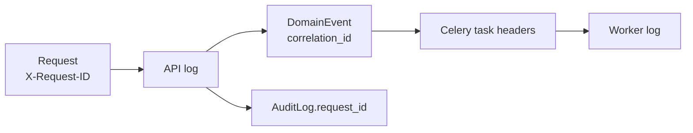

# Observabilidade

Objetivo: dado um problema relatado ("o pedido OF-2026-000123 não foi confirmado"), conseguir
reconstruir o que aconteceu — requisição, use case, eventos, tasks — sem acesso a debugger.

## Logs estruturados

- `structlog` configurado em `shared/logging`, saída **JSON** (console legível em `local`).
- Nome do evento de log: `module.entity.action` (`orders.order.created`,
  `inventory.reservation.expired`, `payments.gateway.timeout`).
- Contexto como chaves, nunca interpolado em texto.

```json
{
  "timestamp": "2026-10-04T13:45:00.123Z",
  "level": "info",
  "service": "orderflow-api",
  "environment": "local",
  "request_id": "7f3c…",
  "correlation_id": "7f3c…",
  "user_id": "…",
  "event": "orders.order.created",
  "order_id": "…",
  "order_number": "OF-2026-000123",
  "total": "1234.50"
}
```

| Nível | Uso |
| --- | --- |
| `debug` | detalhes de desenvolvimento (desligado em produção) |
| `info` | fatos de negócio e marcos (`order.created`, `payment.approved`) |
| `warning` | situação anormal tratada (`stock.busy`, retry de integração) |
| `error` | falha que exigiu interrupção (falha permanente, 500) |

**Nunca logar**: senha, JWT, refresh token, `Authorization`, cartão, secrets, payload completo de
requisições. Um processador remove chaves sensíveis conhecidas (`password`, `token`, `authorization`,
`secret`, `card_*`) como rede de segurança.

## Request ID e Correlation ID

- Middleware gera `request_id` (UUID) por requisição — ou aceita `X-Request-ID` do cliente se
  válido — e devolve no header de resposta.
- `correlation_id` acompanha o fluxo inteiro: nasce com o `request_id` e é propagado para
  Domain Events (`DomainEvent.correlation_id`), headers das tasks Celery e logs dos workers.
- Ambos são vinculados ao contexto do structlog (`contextvars`), aparecendo em todo log do fluxo.
- Implementado na Phase 1: middleware, header de resposta e logs. A propagação para Celery
  (headers da task + `task_prerun`) entra junto com a primeira task real.
- `AuditLog.request_id` liga auditoria a logs.



## Health checks

| Endpoint | Tipo | Verifica | Uso |
| --- | --- | --- | --- |
| `GET /health/live` | liveness | processo responde (sem dependências) | reiniciar container travado |
| `GET /health/ready` | readiness | PostgreSQL (`SELECT 1`), Redis (`PING`), broker alcançável | receber tráfego / `depends_on` |

- Sem autenticação, sem dados sensíveis; resposta `{"status": "ok", "checks": {...}}` com 200/503.
- Timeouts curtos em cada verificação.
- Workers Celery: healthcheck via `celery inspect ping` no Docker Compose.

## Métricas (futuro — Phase 13)

Preparação: nomes de eventos de log estáveis já permitem métricas derivadas. Candidatos:
latência por endpoint (p50/p95/p99), taxa de erros por `code`, pedidos criados/cancelados,
`INSUFFICIENT_STOCK` por produto, tempo de espera por lock de estoque, tamanho das filas Celery,
tasks falhas/re-tentadas, reservas expiradas. Exposição via Prometheus (avaliar
`django-prometheus`) — decisão em ADR na Phase 13.

## Tracing (futuro — Phase 13)

OpenTelemetry (Django, psycopg, Celery, Redis) com o `correlation_id` como atributo. O
`correlation_id` atual é o degrau intermediário: rastreabilidade sem infraestrutura extra.

## Auditoria × logs

| | AuditLog | Logs |
| --- | --- | --- |
| Propósito | registro de negócio (quem fez o quê) | diagnóstico técnico |
| Armazenamento | PostgreSQL, imutável | stdout → agregador |
| Retenção | longa, consultável na UI | curta/média |
| Garantia | transacional (operações críticas) | best-effort |
