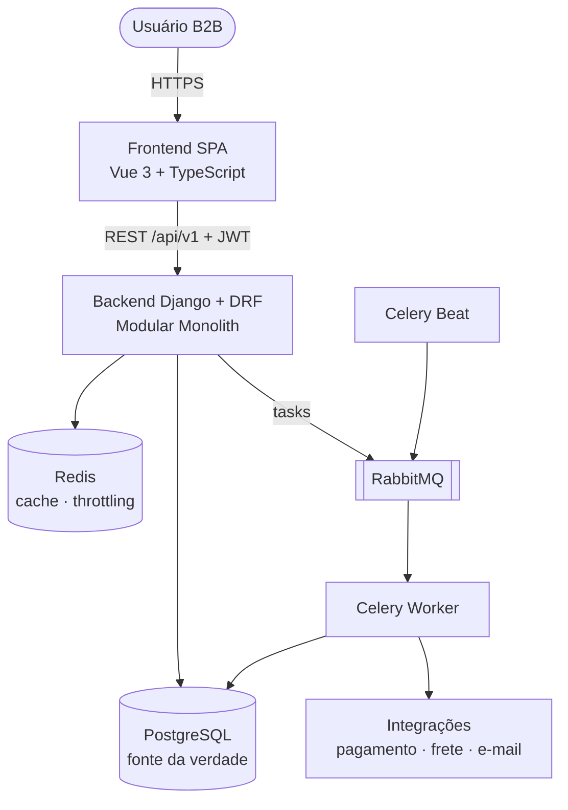

# Visão geral da arquitetura

## Produto

OrderFlow é uma plataforma B2B para gestão de pedidos e estoque: usuários e equipes, clientes,
fornecedores, catálogo, depósitos, saldo e movimentações, reservas, pedidos, preços e descontos,
pagamentos, separação, envio, entrega, cancelamentos, devoluções, notificações e auditoria.

Fluxo principal:

```text
Cliente → Pedido criado → Validação → Reserva de estoque → Pagamento → Separação
        → Preparação para envio → Envio → Entrega
```

Fluxos alternativos: pagamento recusado, estoque insuficiente, reserva expirada, cancelamento,
estorno, devolução, erro de processamento e indisponibilidade temporária de integração
(detalhados em [../domain/orders.md](../domain/orders.md)).

## Princípios

1. **Problema antes da solução** — toda tecnologia ou abstração responde a um problema concreto
   (ADRs em [../adr/](../adr/README.md)).
2. **Simplicidade com fronteiras** — monolito modular, não microsserviços (ADR-001).
3. **O domínio decide** — regras no backend, na camada de domínio; API e frontend são finos.
4. **O banco protege** — invariantes críticas também como constraints (ADR-004).
5. **Correção sob concorrência** — nenhum cenário de corrida pode vender estoque inexistente (ADR-008).
6. **Efeitos secundários fora da requisição** — via eventos e Celery (ADR-005).
7. **Explicável** — para cada decisão: problema, solução, alternativas, trade-offs.

## Arquitetura em uma imagem



Diagramas C4 completos: [../diagrams/c4-model.md](../diagrams/c4-model.md).

## Módulos de negócio

| Módulo | Responsabilidade | Complexidade prevista |
| --- | --- | --- |
| `identity` | Usuários, equipes, roles, permissões, autenticação | média |
| `customers` | Empresas clientes, contatos, segmento comercial | baixa |
| `suppliers` | Fornecedores | baixa |
| `catalog` | Produtos, categorias, SKUs | baixa/média |
| `inventory` | Depósitos, saldo, reservas, movimentações | **alta** |
| `orders` | Ciclo de vida do pedido, orquestração do fluxo comercial | **alta** |
| `pricing` | Tabelas de preço, estratégias de preço, descontos | média |
| `payments` | Pagamentos, refunds, adapter de gateway | média/alta |
| `shipping` | Remessas, rastreio, adapter de provedor | média |
| `notifications` | E-mail/notificações a partir de eventos | baixa |
| `audit` | Registro imutável de operações relevantes | baixa/média |

Fronteiras, donos de dados e dependências: [domain-model.md](domain-model.md).

## Documentos de arquitetura

| Documento | Conteúdo |
| --- | --- |
| [backend.md](backend.md) | Camadas, estrutura dos módulos, padrões de API, erros, Celery, tooling Python |
| [frontend.md](frontend.md) | Estrutura por feature, server/client state, design system, UX |
| [monorepo.md](monorepo.md) | Moonrepo, tarefas, Docker Compose, Makefile, CI |
| [domain-model.md](domain-model.md) | Context map, dependências entre módulos, convenções de dados |
| [event-driven.md](event-driven.md) | Domain Events, despacho, catálogo, Celery, Outbox |
| [security.md](security.md) | Autenticação, RBAC, IDOR, validação, secrets, headers |
| [observability.md](observability.md) | Logs estruturados, request/correlation ID, health checks |

## Roadmap

Cada fase termina com `moon run :check` verde, documentação atualizada e Definition of Done atendida.

| Fase | Escopo | Critério de conclusão |
| --- | --- | --- |
| **0 — Context Engineering** | CLAUDE.md, agents, skills, commands, rules, templates, ADRs, docs, configuração `.moon/` | Documentação revisada e aprovada |
| **1 — Foundation** | `backend/` (Django, settings por ambiente, `shared/` mínimo: erros, paginação, logging, health), `frontend/` (Vite, router, layout, tokens, i18n), `moon.yml` dos projetos, Docker Compose, Makefile, `.env.example`, CI | `docker compose up` funcional; `/health/ready` ok; `moon ci` verde na CI |
| **2 — Identity** | Login/refresh/logout JWT, usuários, equipes, roles, permissões, tela de login | ADR-007 implementado; matriz RBAC testada |
| **3 — Catalog** | Produtos, categorias, fornecedores | CRUD com busca/filtros/paginação + telas |
| **4 — Inventory** | Depósitos, saldo, movimentações, ajustes, recebimentos | Invariantes I1–I5 e movimentos testados |
| **5 — Customers** | Clientes B2B, segmentos | Telas e API |
| **6 — Orders** | Pedido, linhas, máquina de estados, pricing básico, idempotência | Transições e totais testados; ADR-012 implementado |
| **7 — Stock Reservations** | Reserva, expiração, concorrência | Teste da última unidade e de deadlock verdes |
| **8 — Payments** | Pagamento, refund, `FakePaymentGateway`, reconciliação | Fluxos aprovado/recusado/timeout/refund testados; decisão do ADR-011 |
| **9 — Shipping** | Separação, envio, entrega, `FakeShippingProvider` | Fluxo completo até `DELIVERED` |
| **10 — Notifications** | E-mails via eventos, `ConsoleEmailProvider` | Handlers idempotentes |
| **11 — Dashboard** | Indicadores, gráficos, pedidos recentes | Agregados com cache justificado |
| **12 — Audit** | `AuditLog`, consulta e filtros | Operações críticas auditadas |
| **13 — Observability** | Métricas, tracing, painéis | Correlation ID ponta a ponta |

## Fora do escopo inicial

Microsserviços, isolamento físico por tenant (ADR-013), impostos/nota fiscal, multi-moeda efetiva,
devolução parcial, alocação multi-depósito, plataforma de feature flags (a configuração por
ambiente em `config/settings` é o ponto de extensão previsto).
