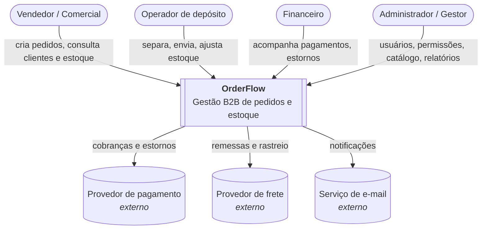
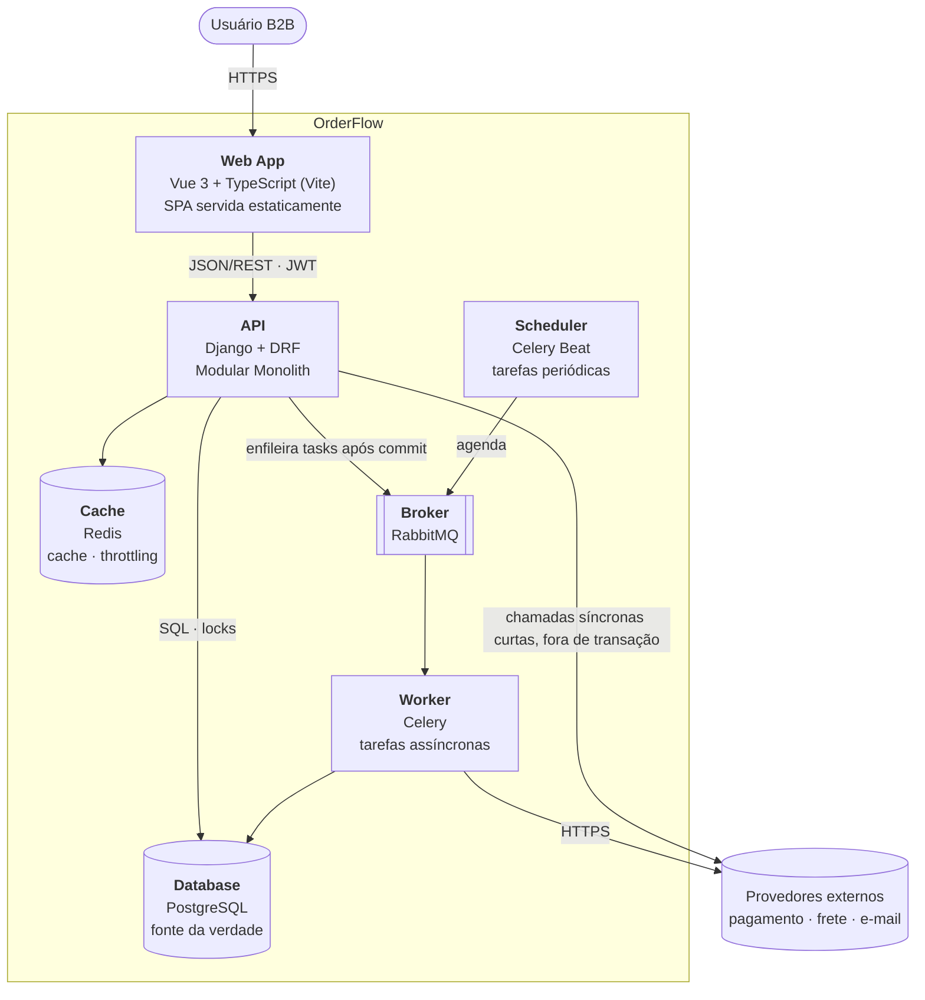
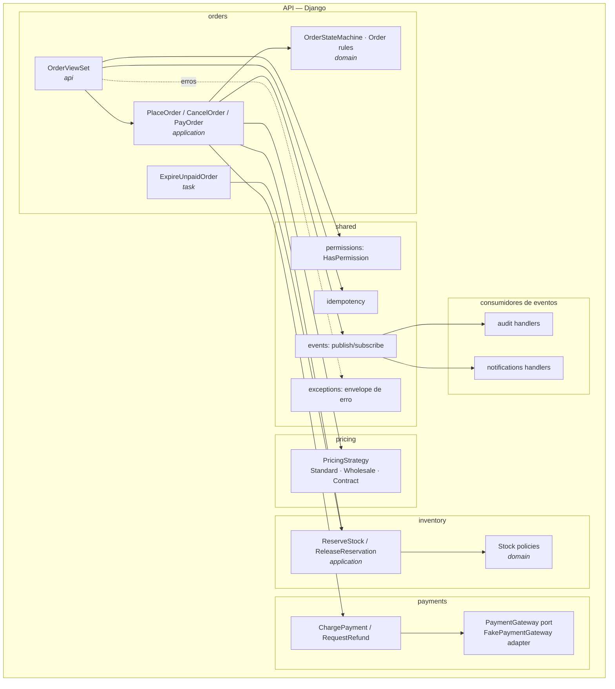
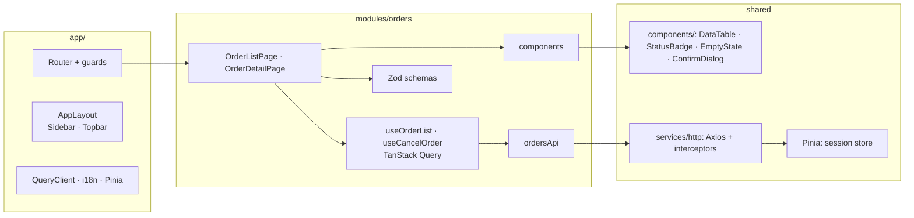

# C4 Model

Diagramas em Mermaid (renderizam no GitHub). Níveis: Context → Container → Component.

## Nível 1 — System Context

Integrações externas começam como adapters fake (`FakePaymentGateway`, `FakeShippingProvider`,
`ConsoleEmailProvider`).

## Nível 2 — Containers

| Container | Tecnologia | Responsabilidade |
| --- | --- | --- |
| Web App | Vue 3, TS, TanStack Query, Pinia | UI, server state, feedback antecipado |
| API | Django, DRF, SimpleJWT, drf-spectacular | regras de negócio, autorização, persistência, OpenAPI |
| Worker | Celery | notificações, integrações, reconciliações |
| Scheduler | Celery Beat | expiração de reservas, limpezas, reconciliação |
| Database | PostgreSQL | dados e invariantes |
| Cache | Redis | cache de leitura, throttling |
| Broker | RabbitMQ | filas de tarefas |

## Nível 3 — Componentes da API (fluxo de pedido)

## Nível 3 — Componentes do Frontend

