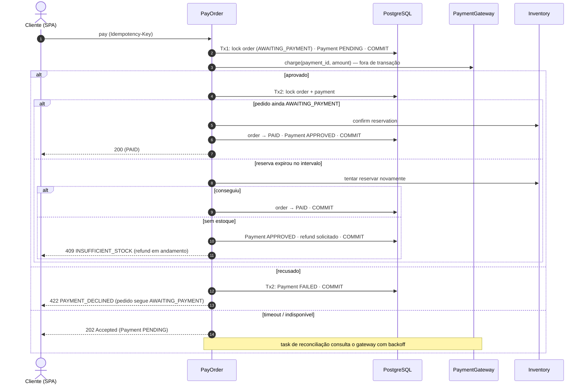
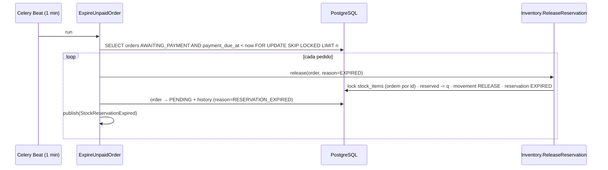
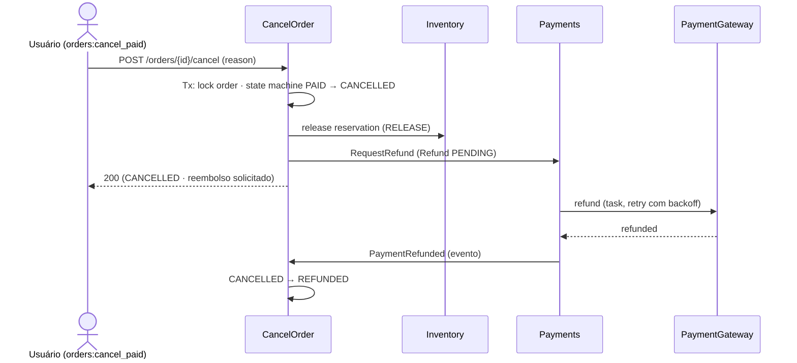

# Fluxos do pedido

Regras completas em [../domain/orders.md](../domain/orders.md) e
[../domain/inventory.md](../domain/inventory.md).

## Criar pedido (`POST /api/v1/orders`)

```mermaid
sequenceDiagram
    autonumber
    actor C as Cliente (SPA)
    participant API as OrderViewSet
    participant ID as Idempotency
    participant UC as PlaceOrder
    participant PR as Pricing
    participant INV as Inventory.ReserveStock
    participant DB as PostgreSQL
    participant EV as shared.events

    C->>API: POST /orders (Idempotency-Key)
    API->>API: autentica · orders:create · valida formato
    API->>UC: execute(PlaceOrderCommand)
    UC->>DB: BEGIN
    UC->>ID: registrar chave (IN_PROGRESS)
    UC->>PR: price_lines(customer, lines)
    PR-->>UC: preços e descontos
    UC->>DB: INSERT order (PENDING) + lines + history
    UC->>INV: reserve(lines)
    INV->>DB: SELECT ... FOR UPDATE stock_item ORDER BY id
    DB-->>INV: on_hand, reserved
    alt available >= quantity (todas as linhas)
        INV->>DB: UPDATE reserved; INSERT reservation + movement
        INV-->>UC: reservas
        UC->>DB: order → AWAITING_PAYMENT + history
        UC->>EV: publish(OrderCreated, StockReserved)
        UC->>ID: gravar resposta (COMPLETED)
        UC->>DB: COMMIT
        EV-->>EV: on_commit → tasks (notificações)
        API-->>C: 201 Created
    else alguma linha sem estoque
        INV-->>UC: InsufficientStock
        UC->>DB: ROLLBACK (inclusive a chave)
        API-->>C: 409 INSUFFICIENT_STOCK
    end
```

## Concorrência na última unidade

```mermaid
sequenceDiagram
    participant A as Tx A (cliente A)
    participant DB as PostgreSQL (stock_item: on_hand=1, reserved=0)
    participant B as Tx B (cliente B)

    A->>DB: SELECT ... FOR UPDATE (lock obtido)
    B->>DB: SELECT ... FOR UPDATE (aguarda lock)
    A->>DB: available=1 ≥ 1 → reserved=1
    A->>DB: COMMIT (libera lock)
    DB-->>B: lock obtido; lê reserved=1 (valor atualizado)
    B->>B: available=0 < 1 → InsufficientStock
    B->>DB: ROLLBACK
```

## Pagamento (`POST /api/v1/orders/{id}/pay`)



## Expiração de reserva (Celery Beat)



## Cancelamento de pedido pago



## Máquina de estados

Ver diagrama `stateDiagram-v2` em [../domain/orders.md](../domain/orders.md#estados).
