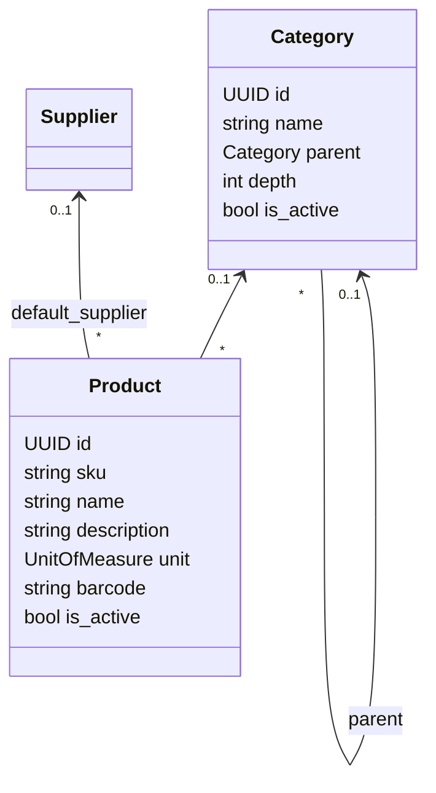

# Domínio: Catalog (Produtos e Categorias)

> Fonte da verdade das regras de catálogo. Implementado na Phase 3.
> Fornecedores: [suppliers.md](suppliers.md).

## Responsabilidade

`catalog` define **o que pode ser vendido**: produtos identificados por SKU, organizados em
categorias. Ele **não** define preço (módulo `pricing`, Phase 6), saldo (módulo `inventory`) nem
condições comerciais. Pedidos guardam um *snapshot* do produto (`docs/domain/orders.md`), então
alterações no catálogo não mudam pedidos existentes.

### Por que o produto não tem preço

Em B2B o preço depende do cliente (tabela, contrato, volume). Um campo `price` no produto viraria
"o preço" por conveniência e as regras comerciais vazariam para o cadastro. O catálogo responde
"o que é"; `pricing` responde "quanto custa para este cliente" (Strategy, Phase 6).

## Modelo

Todos pertencem a uma organização (`TenantScopedModel`, ADR-013).

## Regras

### Produto

| # | Regra | Garantida em |
| --- | --- | --- |
| C1 | SKU obrigatório, normalizado em maiúsculas, formato `[A-Z0-9][A-Z0-9._-]{0,63}` | serviço + CHECK |
| C2 | SKU único por organização | UNIQUE (`organization_id`, `sku`) |
| C3 | Código de barras opcional; se informado, é um GTIN válido (8, 12, 13 ou 14 dígitos com dígito verificador) e único por organização | serviço + UNIQUE parcial |
| C4 | Categoria e fornecedor padrão, se informados, pertencem à mesma organização e estão **ativos** no momento da atribuição | serviço |
| C5 | Unidade de medida em lista fechada: `UNIT`, `BOX`, `PACK`, `PAIR` (quantidades são inteiras no MVP) | choices + CHECK |
| C6 | Produto não é excluído: é **inativado**. Inativo não aparece para venda, mas continua referenciável por pedidos e estoque | serviço |
| C7 | SKU não muda depois de criado (é a identidade de negócio usada em integrações e etiquetas) | API não expõe edição |

### Categoria

| # | Regra | Garantida em |
| --- | --- | --- |
| K1 | Hierarquia com **profundidade máxima 3** (ex.: Bebidas › Refrigerantes › Lata) | serviço |
| K2 | Sem ciclos: uma categoria não pode ser movida para dentro de si mesma ou de um descendente | serviço |
| K3 | Nome único entre irmãs (mesmo pai), sem diferenciar maiúsculas | UNIQUE (`organization_id`, `parent_id`, `lower(name)`) com `NULLS NOT DISTINCT` |
| K4 | Pai de uma categoria ativa precisa estar ativo | serviço |
| K5 | Categoria com subcategorias ativas não pode ser inativada | serviço |
| K6 | Inativar uma categoria **não** inativa seus produtos (eles continuam vendáveis); apenas impede novas atribuições | regra de produto C4 |

Profundidade limitada é uma decisão de UX e de desempenho: navegação e filtros de "categoria e
subcategorias" ficam previsíveis, e a árvore de uma organização cabe em uma consulta.

## Casos de uso

| Use case | Endpoint | Permissão |
| --- | --- | --- |
| Listar/buscar produtos | `GET /api/v1/products?search=&category=&supplier=&is_active=&unit=` | `catalog:read` |
| Criar produto | `POST /api/v1/products` | `catalog:manage` |
| Editar produto (exceto SKU) | `PATCH /api/v1/products/{id}` | `catalog:manage` |
| Ativar/inativar produto | `POST /api/v1/products/{id}/activate` · `/deactivate` | `catalog:manage` |
| Listar categorias (árvore achatada, com caminho) | `GET /api/v1/categories` | `catalog:read` |
| Criar/renomear/mover categoria | `POST /api/v1/categories` · `PATCH /api/v1/categories/{id}` | `catalog:manage` |
| Ativar/inativar categoria | `POST /api/v1/categories/{id}/activate` · `/deactivate` | `catalog:manage` |

O filtro `category` inclui as subcategorias (filtrar por "Bebidas" traz "Refrigerantes").

Interface pública para outros módulos (Phase 6+): `apps.catalog.services.get_sellable_products`
— produtos ativos da organização, por ID.

## Erros de domínio

| Código | HTTP | Quando |
| --- | --- | --- |
| `SKU_ALREADY_IN_USE` | 409 | SKU repetido na organização |
| `BARCODE_ALREADY_IN_USE` | 409 | código de barras repetido na organização |
| `INVALID_BARCODE` | 422 | GTIN com tamanho ou dígito verificador inválido |
| `CATEGORY_NOT_AVAILABLE` | 422 | categoria inexistente, de outra organização ou inativa |
| `SUPPLIER_NOT_AVAILABLE` | 422 | fornecedor inexistente, de outra organização ou inativo |
| `CATEGORY_DEPTH_EXCEEDED` | 422 | criar/mover ultrapassaria 3 níveis |
| `CATEGORY_CYCLE` | 422 | mover para si mesma ou para um descendente |
| `CATEGORY_NAME_ALREADY_IN_USE` | 409 | nome repetido entre irmãs |
| `CATEGORY_HAS_ACTIVE_CHILDREN` | 409 | inativar categoria com subcategorias ativas |
| `PARENT_CATEGORY_INACTIVE` | 422 | ativar/criar sob um pai inativo |

## Cache

Catálogo é candidato a cache (ADR-006), mas **não é cacheado nesta fase**: não há medição que
justifique, e listagens filtradas por organização teriam invalidação não trivial. Revisitar quando
houver métricas de latência.

## Questões em aberto

- Variações de produto (tamanho/cor) e kits.
- Múltiplos fornecedores por produto com custo de compra (entra com compras/recebimento).
- Imagens de produto (upload seguro, armazenamento externo).
