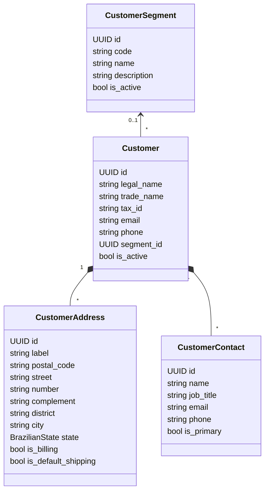

# Domínio: Customers (Clientes)

> Implementado na Phase 5. Módulo de complexidade baixa: `models.py`, `services/`, `selectors.py`,
> `api/` — sem as camadas `application/`/`domain/`, que não se pagariam aqui.

## Responsabilidade

Cadastro das empresas que compram (B2B): dados cadastrais, **segmento comercial**, **endereços** e
**contatos**. O módulo não sabe nada de pedidos ou preços; ele expõe "este cliente está ativo?" e os
dados que `orders` (Phase 6) vai copiar como snapshot. `pricing` (Phase 6) vai associar tabelas de
preço a segmentos.

## Modelo

### Por que o segmento é uma tabela e não um enum

Cada organização classifica seus clientes de um jeito (atacado, varejo, distribuidor, rede,
governo...). Com um enum, toda empresa usaria os mesmos segmentos e uma mudança exigiria deploy. O
custo é um cadastro a mais; o ganho é que a `PriceList` da Phase 6 aponta para um segmento definido
pela própria empresa. O segmento é **opcional**: cliente sem segmento usa o preço padrão.

### Por que endereços e contatos são entidades próprias

Em B2B a mesma empresa compra para várias filiais (vários endereços de entrega) e quem compra,
quem paga e quem recebe costumam ser pessoas diferentes. Campos fixos no cliente obrigariam a
cadastrar a mesma empresa várias vezes. Um único endereço pode ser ao mesmo tempo o de cobrança e
o de entrega padrão (caso comum da matriz), por isso os papéis são **marcadores** no endereço, não
tipos de endereço.

### Dados pessoais (LGPD)

Contatos são pessoas físicas: nome, e-mail e telefone são **dados pessoais**. Não aparecem em logs
(os eventos registram só IDs) e só são lidos por quem tem `customers:read`.

## Regras

### Segmentos

| # | Regra | Garantida em |
| --- | --- | --- |
| SG1 | `code` com 2–30 caracteres `A–Z 0–9 _ -`, normalizado para maiúsculas, único por organização e **imutável** | serviço + UNIQUE + CHECK |
| SG2 | Segmento com clientes **ativos** não pode ser inativado (`SEGMENT_IN_USE`) | serviço, com lock |
| SG3 | Segmento inativo não pode ser atribuído a um cliente | serviço (CU4) |

### Clientes

| # | Regra | Garantida em |
| --- | --- | --- |
| CU1 | CNPJ válido (numérico ou alfanumérico) | serviço (validador de `shared/domain/documents.py`) |
| CU2 | CNPJ único por organização | UNIQUE (`organization_id`, `tax_id`) |
| CU3 | Cliente não é excluído: é inativado; pedidos históricos mantêm a referência | serviço |
| CU4 | Ao criar, ao trocar de segmento ou ao **reativar** o cliente, o segmento (se houver) precisa estar ativo | serviço, com lock no segmento |
| CU5 | Cliente inativo não pode receber pedidos | `selectors.get_active_customer` (usado por `orders`) |

**Concorrência entre SG2 e CU4.** Sem cuidado, uma inativação de segmento e um cadastro de cliente
naquele segmento podem acontecer ao mesmo tempo: a inativação conta zero clientes ativos, o cadastro
vê o segmento ainda ativo, e os dois gravam. Os dois fluxos bloqueiam a linha do segmento
(`SELECT ... FOR UPDATE`) antes de decidir, então um espera o outro. O custo — cadastros no mesmo
segmento esperam uns aos outros — é irrelevante para a frequência de cadastro de clientes; por isso
não usamos `FOR SHARE` (que exigiria SQL manual) como no estoque.

### Endereços

| # | Regra | Garantida em |
| --- | --- | --- |
| AD1 | CEP com 8 dígitos (armazenado sem máscara); UF entre as 27 unidades da federação; rótulo, logradouro, número, bairro e cidade obrigatórios | serviço/serializer + CHECK |
| AD2 | No máximo um endereço de cobrança e um de entrega padrão por cliente | UNIQUE parcial |
| AD3 | Se o cliente tem endereços, **exatamente um** é o de cobrança e **exatamente um** é o de entrega padrão: o primeiro endereço recebe os dois papéis; remover um endereço com papel promove o endereço mais antigo restante; marcar outro endereço move o papel | serviço, com lock no cliente |
| AD4 | Endereços podem ser removidos fisicamente: o pedido (Phase 6) guarda uma cópia do endereço de entrega | — |

### Contatos

| # | Regra | Garantida em |
| --- | --- | --- |
| CT1 | Nome obrigatório e pelo menos um canal (e-mail ou telefone) | serviço + CHECK |
| CT2 | Se o cliente tem contatos, **exatamente um** é o principal (mesma mecânica de AD3) | serviço, com lock no cliente + UNIQUE parcial |
| CT3 | Contatos podem ser removidos fisicamente | — |

**Por que travar o cliente em AD3/CT2.** Dois cadastros simultâneos do primeiro endereço veriam
"nenhum endereço ainda" e ambos tentariam virar o padrão; o UNIQUE parcial impediria o estado
inválido, mas a segunda requisição falharia com erro de integridade. Com o lock na linha do cliente,
a segunda espera, vê o primeiro endereço e é gravada sem papéis. O banco continua sendo a última
defesa (AD2).

## Casos de uso

| Use case | Endpoint | Permissão |
| --- | --- | --- |
| Listar/buscar segmentos | `GET /api/v1/customer-segments?search=&is_active=` | `customers:read` |
| Criar/editar segmento | `POST /api/v1/customer-segments` · `PATCH /{id}` | `customers:manage_segments` |
| Ativar/inativar segmento | `POST /api/v1/customer-segments/{id}/activate` · `/deactivate` | `customers:manage_segments` |
| Listar/buscar clientes | `GET /api/v1/customers?search=&is_active=&segment=` | `customers:read` |
| Detalhar cliente | `GET /api/v1/customers/{id}` | `customers:read` |
| Criar cliente | `POST /api/v1/customers` | `customers:create` |
| Editar cliente | `PATCH /api/v1/customers/{id}` | `customers:update` |
| Ativar/inativar cliente | `POST /api/v1/customers/{id}/activate` · `/deactivate` | `customers:update` |
| Endereços | `GET`/`POST /api/v1/customers/{id}/addresses` · `PATCH`/`DELETE /{address_id}` | `customers:read` / `customers:update` |
| Mover papel de endereço | `POST .../addresses/{address_id}/set-billing` · `/set-default-shipping` | `customers:update` |
| Contatos | `GET`/`POST /api/v1/customers/{id}/contacts` · `PATCH`/`DELETE /{contact_id}` | `customers:read` / `customers:update` |
| Definir contato principal | `POST .../contacts/{contact_id}/set-primary` | `customers:update` |

Segmentos são configuração comercial (afetarão preços na Phase 6), por isso têm permissão própria,
restrita a ADMIN e MANAGER; SALES cadastra clientes, mas não cria segmentos.

Endereço ou contato de outro cliente — ou de outra organização — responde **404**, mesmo que o ID
exista (anti-IDOR): o queryset é filtrado pela organização **e** pelo cliente da URL.

## Interface pública para outros módulos

| Função | Uso |
| --- | --- |
| `selectors.get_active_customer(organization_id, customer_id)` | `orders` valida o cliente (CU5) |

## Erros de domínio

| Código | HTTP | Quando |
| --- | --- | --- |
| `INVALID_TAX_ID` | 422 | CNPJ com formato ou dígitos verificadores inválidos |
| `TAX_ID_ALREADY_IN_USE` | 409 | CNPJ já cadastrado para outro cliente da organização |
| `INVALID_SEGMENT_CODE` | 422 | Código de segmento fora do formato |
| `SEGMENT_CODE_ALREADY_IN_USE` | 409 | Código de segmento repetido na organização |
| `SEGMENT_NOT_AVAILABLE` | 422 | Segmento inexistente ou inativo na criação/edição/reativação do cliente |
| `SEGMENT_IN_USE` | 409 | Inativação de segmento com clientes ativos |
| `INVALID_POSTAL_CODE` | 422 | CEP sem 8 dígitos |
| `CONTACT_CHANNEL_REQUIRED` | 422 | Contato sem e-mail e sem telefone |

## Fora do escopo (registrado para fases futuras)

- Limite de crédito e aprovação comercial (questão em aberto em `orders.md`).
- Inscrição estadual e regime tributário (impostos estão fora do MVP).
- Preenchimento do endereço pelo CEP (ViaCEP): seria a primeira integração externa síncrona do
  cadastro; entra com um adapter quando houver demanda.
- Restringir a visibilidade de clientes por equipe ou carteira: decisão de produto da Phase 2 é que
  SALES vê todos os clientes da organização.
