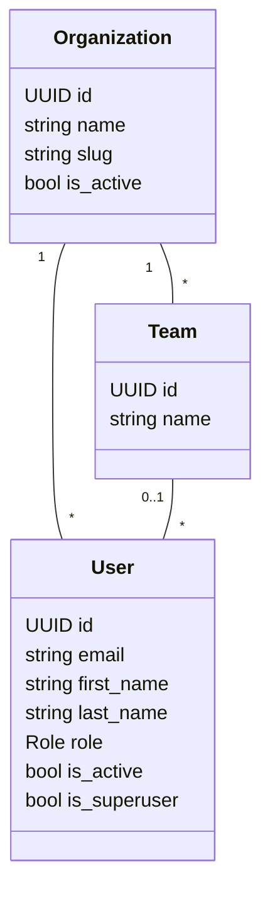

# Domínio: Identity

> Fonte da verdade de organizações (tenants), usuários, equipes, papéis, permissões e autenticação.
> Decisões: [ADR-007](../adr/007-jwt-authentication.md) (JWT) e
> [ADR-013](../adr/013-multi-tenancy.md) (multi-tenancy).

## Responsabilidade

`identity` decide **quem é o usuário, a qual organização pertence e o que pode fazer**. Ele é o dono
do catálogo de permissões e da política papel → permissões. Ele não conhece regras de pedidos,
estoque ou pagamentos: outros módulos apenas perguntam "este usuário tem `orders:cancel`?".

## Modelo

- Login por **e-mail** (único na plataforma inteira) e senha.
- Cada usuário tem **um** papel dentro da sua organização.
- Equipe é organizacional (agrupamento, relatórios futuros); **não restringe visibilidade** —
  decisão de produto: SALES vê todos os clientes e pedidos da própria organização.
- Superusuário da plataforma (`is_superuser`) opera apenas o Django admin; não pertence a uma
  organização e não usa a API de negócio.

## Papéis e permissões

Permissões no formato `resource:action`, definidas em `apps/identity/domain/permissions.py`.
A matriz papel → permissões está em [../architecture/security.md](../architecture/security.md#matriz-inicial)
e é a política vigente (testada por teste parametrizado).

| Papel | Propósito |
| --- | --- |
| `ADMIN` | administra a organização: usuários, equipes, papéis + todas as operações |
| `MANAGER` | gestão comercial e operacional, sem administração de usuários |
| `SALES` | clientes e pedidos |
| `WAREHOUSE` | estoque, separação e envio |
| `FINANCE` | pagamentos, estornos, relatórios financeiros |
| `VIEWER` | somente leitura |

Mudar a política de um papel exige deploy (ela vive no código, versionada e revisada). O que muda
em runtime é o papel de cada usuário — e isso é registrado.

## Invariantes

| # | Invariante | Garantida em |
| --- | --- | --- |
| ID1 | Todo usuário não-superusuário pertence a uma organização | CHECK `identity_user_org_required_check` |
| ID2 | E-mail único na plataforma (case-insensitive) | UNIQUE em `lower(email)` + normalização |
| ID3 | Equipe pertence à mesma organização do usuário | domínio (use case) |
| ID4 | Nome de equipe único por organização | UNIQUE (`organization_id`, `name`) |
| ID5 | Toda organização ativa mantém **pelo menos um ADMIN ativo** | domínio, com lock da organização |
| ID6 | Usuário não altera o próprio papel nem se desativa | domínio |
| ID7 | Usuário inativo ou de organização inativa não autentica (inclusive com token já emitido) | autenticação |

ID5 é protegida contra corrida: dois ADMINs rebaixando um ao outro ao mesmo tempo poderiam
deixar a organização sem administrador. Os use cases que mudam papel/status bloqueiam a linha da
organização (`select_for_update`) antes de contar os ADMINs ativos.

## Autenticação (ADR-007)

| Endpoint | Descrição |
| --- | --- |
| `POST /api/v1/auth/login` | `{email, password}` → `{access, user}` + cookie `refresh` |
| `POST /api/v1/auth/refresh` | lê o cookie `refresh`, rotaciona (antigo vai para a blacklist) → `{access}` + novo cookie |
| `POST /api/v1/auth/logout` | blacklist do refresh atual e remoção do cookie |
| `GET /api/v1/auth/me` | usuário atual, organização, papel e permissões efetivas |

- Access token: 10 min, em memória no frontend. Refresh: 7 dias, cookie `HttpOnly`,
  `SameSite=Strict`, `Secure` fora de dev, `path=/api/v1/auth/`.
- Refresh e logout exigem o header `X-Requested-With: XMLHttpRequest` (defesa extra contra CSRF:
  formulários de outros sites não conseguem enviá-lo sem passar pelo CORS).
- Troca de senha invalida **access tokens** emitidos antes dela (`CHECK_REVOKE_TOKEN`). O SimpleJWT
  não aplica essa verificação ao refresh token: o fluxo de troca/redefinição de senha (quando
  existir) deve colocar na blacklist todos os `OutstandingToken` do usuário.
- A chave de assinatura (HMAC-SHA256) precisa ter pelo menos 32 bytes; `production.py` recusa
  iniciar com chave menor e os testes tratam o aviso do PyJWT como erro.
- Falhas de login respondem sempre `401 INVALID_CREDENTIALS` com a mesma mensagem — sem revelar
  se o e-mail existe, se o usuário está inativo ou se a organização está suspensa.
- Throttling dedicado (`auth`) em login e refresh.

## Casos de uso

| Use case | Endpoint | Permissão | Registro |
| --- | --- | --- | --- |
| `CreateUser` | `POST /api/v1/users` (sem `password` = convite por e-mail) | `users:manage` | log `identity.user.created`; evento `identity.user.invited` |
| `ResendInvitation` | `POST /api/v1/users/{id}/resend-invitation` | `users:manage` | evento `identity.user.invited` |
| `RequestPasswordReset` | `POST /api/v1/auth/password-reset` (público, `5/hour`) | — | evento `identity.password_reset.requested` |
| `ResetPassword` | `POST /api/v1/auth/password-reset/confirm` (público) | token do link | log `identity.password_reset.completed` |
| `UpdateUser` (nome, equipe) | `PATCH /api/v1/users/{id}` | `users:manage` | — |
| `ChangeUserRole` | `POST /api/v1/users/{id}/change-role` | `users:manage` | log `identity.user.role_changed` (→ `AuditLog` `USER_PERMISSION_CHANGED` na Phase 12) |
| `DeactivateUser` / `ActivateUser` | `POST /api/v1/users/{id}/deactivate` · `/activate` | `users:manage` | log |
| `CreateTeam` / `RenameTeam` | `POST /api/v1/teams` · `PATCH /api/v1/teams/{id}` | `users:manage` | — |
| Listagens | `GET /api/v1/users`, `GET /api/v1/teams` | `users:manage` | — |
| `CreateOrganization` | comando `manage.py create_organization` | operador da plataforma | log |

## Senhas por e-mail (Phase 10)

- **Convite (padrão):** o ADMIN cria o usuário sem senha (`set_unusable_password`); a pessoa
  recebe um link e define a própria senha — ninguém mais a conhece. A senha inicial definida pelo
  ADMIN continua possível. `invitation_pending` = conta sem senha utilizável; o convite pode ser
  reenviado enquanto pendente (`INVITATION_NOT_PENDING` depois).
- **Esqueci minha senha:** a resposta é sempre `202`, exista ou não a conta, e o e-mail só sai para
  contas que podem entrar (ativa, organização ativa) — sem enumeração de e-mails. Throttle próprio
  (`password_reset`, 5 por hora por IP).
- **Token sem estado** (`django.contrib.auth.tokens.default_token_generator`): assinado com a
  `SECRET_KEY` sobre o hash da senha, o último login e o e-mail. Não é guardado em lugar nenhum
  (nem banco, nem outbox, nem broker: o link é gerado na hora do envio pelo
  `application.passwords.password_setup_link`), é de **uso único** (definir a senha muda o hash) e
  expira em `PASSWORD_RESET_TIMEOUT` (72 h).
- **Link com fragmento** (`/reset-password#uid=…&token=…`): o navegador não envia fragmento ao
  servidor (fora de logs de acesso e do `Referer`); a tela tira o token da barra de endereço e do
  histórico assim que o lê.
- **Definir a senha encerra as sessões abertas** (todos os refresh tokens do usuário vão para a
  blacklist) e aplica os validadores de senha do Django (`WEAK_PASSWORD`, com as razões).

Onboarding de organização é feito pelo operador da plataforma (comando de gestão); cadastro
público de organizações está fora do MVP.

## Erros de domínio

| Código | HTTP | Quando |
| --- | --- | --- |
| `INVALID_CREDENTIALS` | 401 | login inválido (qualquer motivo) |
| `INVALID_REFRESH_TOKEN` | 401 | cookie ausente, expirado, rotacionado ou na blacklist |
| `LAST_ADMIN_REQUIRED` | 409 | mudança deixaria a organização sem ADMIN ativo |
| `SELF_MANAGEMENT_NOT_ALLOWED` | 409 | usuário tentando mudar o próprio papel ou se desativar |
| `TEAM_NOT_FOUND` | 422 | equipe inexistente na organização |
| `EMAIL_ALREADY_IN_USE` | 409 | e-mail já cadastrado na plataforma |
| `INVALID_PASSWORD_RESET_TOKEN` | 400 | link expirado, já usado, adulterado ou de conta inativa (uma resposta só) |
| `WEAK_PASSWORD` | 422 | senha nova reprovada pela política (`details.reasons`, `details.field = password`) |
| `INVITATION_NOT_PENDING` | 409 | reenviar convite para quem já definiu a senha ou está inativo |

## Questões em aberto

- SSO/OIDC corporativo (ADR-007, "quando revisitar").
- Usuário em várias organizações (ADR-013).
