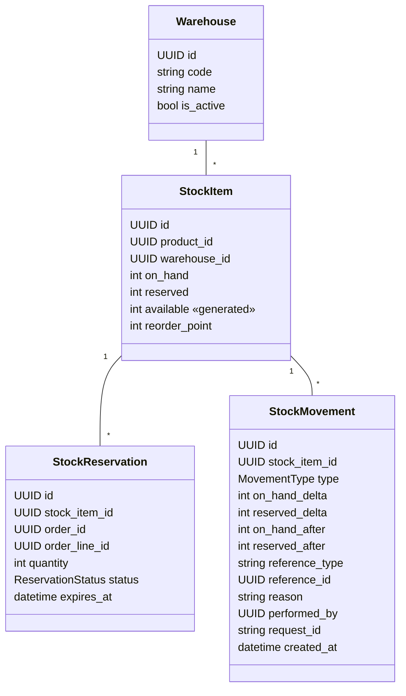

# Domínio: Inventory (Estoque)

> Fonte da verdade das regras de estoque. Implementação prevista nas Phases 4 (saldo e movimentos)
> e 7 (reservas). Decisão de concorrência: [ADR-008](../adr/008-stock-concurrency-control.md).

## Responsabilidade

`inventory` é dono de **quanto existe, quanto está comprometido e por quê**. Ele decide se uma
quantidade pode ser reservada, registra toda alteração de saldo e garante que nenhuma unidade seja
vendida duas vezes. Ele **não** conhece regras de pedido: recebe referências (`order_id`,
`order_line_id`) como dados opacos.

## Conceitos

```text
on_hand    unidades fisicamente no depósito
reserved   unidades comprometidas com pedidos ainda não enviados
available  on_hand - reserved   → o que pode ser vendido agora
```

Exemplo: `on_hand = 10`, pedidos aguardando pagamento reservam 3 → `reserved = 3`, `available = 7`.
Ao enviar um desses pedidos (2 unidades): `on_hand = 8`, `reserved = 1`, `available = 7`.

### `available`: persistido ou calculado?

**Decisão: coluna gerada pelo banco** (`GeneratedField(expression=F("on_hand") - F("reserved"),
db_persist=True)`).

| Opção | Prós | Contras |
| --- | --- | --- |
| Calcular sempre na query (`annotate`) | sem redundância | não indexável; filtros de "estoque baixo" fazem scan |
| Coluna mantida pela aplicação | indexável | dupla escrita: qualquer caminho que esqueça de atualizar corrompe o dado |
| **Coluna gerada pelo PostgreSQL** | indexável, impossível divergir, zero código de manutenção | requer Django ≥ 5.0 (atendido); não pode ser escrita diretamente (desejável) |

## Modelo



## Movimentações (`StockMovement`)

Toda alteração de `on_hand` ou `reserved` gera **exatamente um** movimento por `StockItem` afetado,
na mesma transação. A tabela é **append-only** (sem update, sem delete, sem soft delete). Correções
são feitas com novos movimentos (`ADJUSTMENT`).

| Tipo | `on_hand` | `reserved` | Origem |
| --- | --- | --- | --- |
| `PURCHASE` | `+q` | 0 | Recebimento de compra de fornecedor |
| `RESERVATION` | 0 | `+q` | Reserva para linha de pedido |
| `RELEASE` | 0 | `−q` | Cancelamento ou expiração de reserva |
| `SALE` | `−q` | `−q` | Envio do pedido (consome a reserva) |
| `ADJUSTMENT` | `±q` | 0 | Inventário/correção manual — motivo obrigatório, permissão `inventory:adjust` |
| `RETURN` | `+q` | 0 | Devolução aceita para estoque vendável |
| `TRANSFER` | `−q` origem / `+q` destino | 0 | Dois movimentos com o mesmo `reference_id` de transferência |

`on_hand_after`/`reserved_after` guardam o saldo resultante — permitem auditoria e reconciliação
sem recalcular todo o histórico.

## Reservas (`StockReservation`)

| Status | Significado | Próximos |
| --- | --- | --- |
| `ACTIVE` | Reservada, aguardando pagamento até `expires_at` | `CONFIRMED`, `RELEASED`, `EXPIRED` |
| `CONFIRMED` | Pagamento aprovado; não expira | `CONSUMED`, `RELEASED` |
| `CONSUMED` | Mercadoria enviada (`SALE`) | — |
| `RELEASED` | Liberada por cancelamento | — |
| `EXPIRED` | Liberada por expiração | — |

- Validade padrão: `STOCK_RESERVATION_TTL` (configurável; padrão 30 minutos).
- A expiração é disparada pelo módulo `orders` (`ExpireUnpaidOrder`, Celery Beat), que chama
  `inventory.application.ReleaseReservation(reason=EXPIRED)`. Assim a dependência é sempre
  `orders → inventory`, nunca o inverso.

## Invariantes

| # | Invariante | Garantida em |
| --- | --- | --- |
| I1 | `on_hand >= 0` | domínio + CHECK `stock_item_on_hand_non_negative_check` |
| I2 | `reserved >= 0` | domínio + CHECK `stock_item_reserved_non_negative_check` |
| I3 | `reserved <= on_hand` (logo `available >= 0`) | domínio + CHECK `stock_item_reserved_lte_on_hand_check` |
| I4 | Um `StockItem` por (`product_id`, `warehouse_id`) | UNIQUE |
| I5 | `quantity > 0` em reservas e `≠ 0` nos deltas de movimento | CHECK |
| I6 | `reserved` = Σ `quantity` das reservas `ACTIVE` + `CONFIRMED` do item | application (mesma transação) + job de reconciliação |
| I7 | `on_hand` = Σ `on_hand_delta` dos movimentos do item | application + job de reconciliação |
| I8 | No máximo uma reserva não-terminal por (`order_line_id`, `stock_item_id`) | UNIQUE parcial |
| I9 | `ADJUSTMENT` não pode deixar `on_hand < reserved` | domínio + I3 |

I6 e I7 não são expressáveis como constraint simples; um job periódico de reconciliação compara os
valores e registra alerta em caso de divergência (nunca corrige silenciosamente).

## Concorrência

Resumo do [ADR-008](../adr/008-stock-concurrency-control.md):

1. Toda operação que altera `StockItem` roda em `transaction.atomic()`.
2. Locks com `select_for_update()` em **ordem determinística** (por `id` ascendente).
3. **Ordem global de locks entre agregados**: `Order` → `StockItem` (por `id`) → `StockReservation`.
   Todo use case que bloqueia mais de um tipo segue essa ordem (evita deadlock entre `PlaceOrder`,
   `CancelOrder`, `ExpireUnpaidOrder` e `ShipOrder`).
4. Verificação de disponibilidade **após** obter o lock (nunca antes).
5. Atualizações com `F()` expressions; constraints do banco como última defesa.
6. `lock_timeout` curto → `STOCK_BUSY` (409, re-tentável).
7. Nada de I/O externo (gateway, e-mail, HTTP) dentro de transação que segura lock de estoque.
8. Jobs em lote (expiração, reconciliação) usam `select_for_update(skip_locked=True)`.

### Cenário obrigatório

```text
available = 1
Cliente A: PlaceOrder(qty=1)  ┐ simultâneos
Cliente B: PlaceOrder(qty=1)  ┘
Resultado: exatamente um 201; o outro 409 INSUFFICIENT_STOCK
           reserved = 1, uma reserva ACTIVE, um movimento RESERVATION
```

## Casos de uso

| Use case | Chamado por | Permissão | Eventos |
| --- | --- | --- | --- |
| `ReserveStock` | orders (`PlaceOrder`, `ReserveOrderStock`) | — (interno) | `StockReserved` |
| `ConfirmReservation` | orders (`PayOrder`) | — (interno) | — |
| `ReleaseReservation` | orders (`CancelOrder`, `ExpireUnpaidOrder`) | — (interno) | `StockReleased` / `StockReservationExpired` |
| `ConsumeReservation` | orders (`ShipOrder`) | — (interno) | `StockConsumed` |
| `ReceivePurchase` | API `POST /api/v1/inventory/receipts` | `inventory:update` | `StockReceived` |
| `AdjustStock` | API `POST /api/v1/inventory/adjustments` | `inventory:adjust` | `StockAdjusted` |
| `TransferStock` | API `POST /api/v1/inventory/transfers` | `inventory:update` | `StockTransferred` |
| `ReturnToStock` | orders (`CompleteReturn`) | — (interno) | `StockReturned` |

Leituras: `GET /api/v1/inventory/stock-items` (filtros por produto, depósito, `low_stock=true`),
`GET /api/v1/inventory/movements` (paginado, filtros por item, tipo, período).

## Eventos

| Evento | Quando | Consumidores |
| --- | --- | --- |
| `StockReserved` | reserva criada | audit |
| `StockReleased` | reserva liberada por cancelamento | audit |
| `StockReservationExpired` | reserva expirada | audit, notifications (vendedor) |
| `StockAdjusted` | ajuste manual | audit (`STOCK_ADJUSTED`) |
| `StockLevelLow` | `available` cruzou `reorder_point` para baixo | notifications, dashboard |

## Erros de domínio

| Código | HTTP | Quando |
| --- | --- | --- |
| `INSUFFICIENT_STOCK` | 409 | `available < quantity` |
| `STOCK_BUSY` | 409 | Timeout de lock |
| `INVALID_ADJUSTMENT` | 422 | Ajuste deixaria `on_hand < reserved` ou `on_hand < 0` |
| `RESERVATION_NOT_ACTIVE` | 409 | Operação sobre reserva em status terminal |
| `WAREHOUSE_INACTIVE` | 422 | Depósito inativo |

## Cache

Saldo de estoque **não é cacheado** (ADR-006): é dado crítico e muda a cada pedido.

## Questões em aberto

- Alocação automática entre depósitos (hoje: um depósito por pedido).
- Estoque em quarentena/avariado para devoluções não vendáveis.
- Lotes, validade e número de série (fora do MVP).
