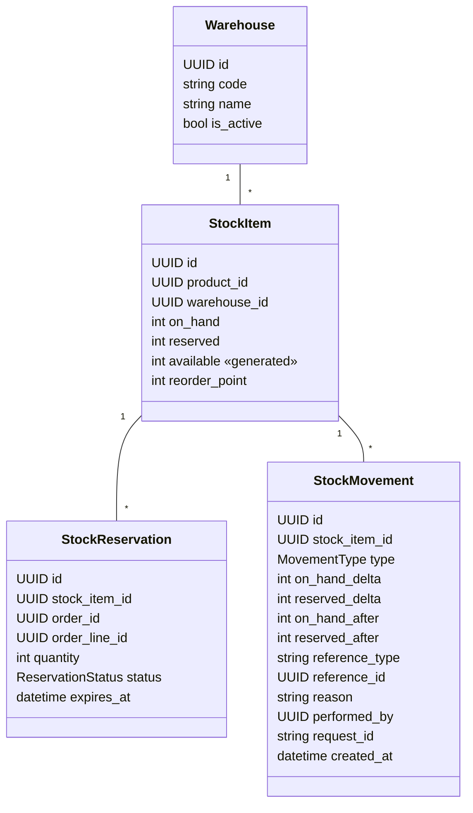

# Domínio: Inventory (Estoque)

> Fonte da verdade das regras de estoque. Phase 4 implementou depósitos, saldo, movimentações,
> recebimentos, ajustes e transferências; Phase 7, reservas, liberação, expiração (via `orders`),
> disponibilidade para a tela e reconciliação; Phase 8, `CONFIRMED` no pagamento; Phase 9,
> `CONSUMED` no despacho (`consume_reservations`: movimento `SALE`, `on_hand` e `reserved` −q).
> Decisão de concorrência: [ADR-008](../adr/008-stock-concurrency-control.md).

## Responsabilidade

`inventory` é dono de **quanto existe, quanto está comprometido e por quê**. Ele decide se uma
quantidade pode ser reservada, registra toda alteração de saldo e garante que nenhuma unidade seja
vendida duas vezes. Ele **não** conhece regras de pedido: recebe referências (`order_id`,
`order_line_id`) como dados opacos.

## Conceitos

```text
on_hand    unidades fisicamente no depósito
reserved   unidades comprometidas com pedidos ainda não enviados
available  on_hand - reserved   → o que pode ser vendido agora
```

Exemplo: `on_hand = 10`, pedidos aguardando pagamento reservam 3 → `reserved = 3`, `available = 7`.
Ao enviar um desses pedidos (2 unidades): `on_hand = 8`, `reserved = 1`, `available = 7`.

### `available`: persistido ou calculado?

**Decisão: coluna gerada pelo banco** (`GeneratedField(expression=F("on_hand") - F("reserved"),
db_persist=True)`).

| Opção | Prós | Contras |
| --- | --- | --- |
| Calcular sempre na query (`annotate`) | sem redundância | não indexável; filtros de "estoque baixo" fazem scan |
| Coluna mantida pela aplicação | indexável | dupla escrita: qualquer caminho que esqueça de atualizar corrompe o dado |
| **Coluna gerada pelo PostgreSQL** | indexável, impossível divergir, zero código de manutenção | requer Django ≥ 5.0 (atendido); não pode ser escrita diretamente (desejável) |

## Modelo



## Movimentações (`StockMovement`)

Toda alteração de `on_hand` ou `reserved` gera **exatamente um** movimento por `StockItem` afetado,
na mesma transação. A tabela é **append-only** (sem update, sem delete, sem soft delete). Correções
são feitas com novos movimentos (`ADJUSTMENT`).

| Tipo | `on_hand` | `reserved` | Origem |
| --- | --- | --- | --- |
| `PURCHASE` | `+q` | 0 | Recebimento de compra de fornecedor |
| `RESERVATION` | 0 | `+q` | Reserva para linha de pedido |
| `RELEASE` | 0 | `−q` | Cancelamento ou expiração de reserva |
| `SALE` | `−q` | `−q` | Envio do pedido (consome a reserva) |
| `ADJUSTMENT` | `±q` | 0 | Inventário/correção manual — motivo obrigatório, permissão `inventory:adjust` |
| `RETURN` | `+q` | 0 | Devolução aceita para estoque vendável |
| `TRANSFER` | `−q` origem / `+q` destino | 0 | Dois movimentos com o mesmo `reference_id` de transferência |

`on_hand_after`/`reserved_after` guardam o saldo resultante — permitem auditoria e reconciliação
sem recalcular todo o histórico.

Na Phase 4 a imutabilidade é garantida **no banco**: um trigger rejeita `UPDATE` e `DELETE` em
`inventory_stock_movement`. Nem código novo, nem script manual, nem o Django admin conseguem
reescrever o histórico.

## Depósitos (`Warehouse`)

| # | Regra | Garantida em |
| --- | --- | --- |
| W1 | Código curto (`[A-Z0-9-]{2,20}`, maiúsculas) único por organização | serviço + UNIQUE + CHECK |
| W2 | Depósito inativo não recebe movimentações (recebimento, ajuste, transferência) | serviço |
| W3 | Só pode ser inativado com saldo zero (`on_hand = 0` e `reserved = 0` em todos os itens) | serviço, com lock dos itens |

## Recebimento (`StockReceipt`)

Documento de entrada de mercadoria: depósito, fornecedor (opcional), número do documento
(nota fiscal, opcional), observações e **linhas** (produto + quantidade). Cada linha gera um
movimento `PURCHASE` referenciando o recebimento.

| # | Regra |
| --- | --- |
| R1 | Pelo menos uma linha; quantidades inteiras > 0; um produto aparece uma vez por recebimento |
| R2 | Produtos ativos da organização; fornecedor, se informado, ativo |
| R3 | Número do documento único por (organização, fornecedor): a mesma nota não entra duas vezes (deduplicação natural contra envio repetido) |
| R4 | Tudo-ou-nada: qualquer linha inválida desfaz o recebimento inteiro |

Recebimento é a operação que cria o `StockItem` de um produto em um depósito. Dois recebimentos
simultâneos do mesmo produto novo no mesmo depósito não podem criar dois itens: o item é criado com
`INSERT ... ON CONFLICT DO NOTHING` e só então bloqueado (`SELECT ... FOR UPDATE`).

## Ajuste por contagem (`ADJUSTMENT`)

O usuário informa a **quantidade contada** (não um delta), o **motivo** e a quantidade que via na
tela ao contar (`expected_on_hand`).

| # | Regra |
| --- | --- |
| A1 | Motivo obrigatório (mín. 5 caracteres) |
| A2 | `expected_on_hand` diferente do saldo atual → `409 STOCK_CHANGED_SINCE_COUNT`: houve movimentação entre a contagem e o envio; recontar evita sobrescrevê-la |
| A3 | Quantidade contada não pode ser menor que `reserved` (`INVALID_ADJUSTMENT`) |
| A4 | Contagem igual ao saldo não gera movimento (delta zero) |

A regra A2 é um **controle otimista** sobre uma operação humana longa (contar prateleiras leva
minutos), combinado com o lock pessimista curto da gravação (ADR-008).

## Transferência (`TRANSFER`)

Origem e destino distintos e ativos, produto da organização, quantidade > 0 e
`available` na origem ≥ quantidade. Gera dois movimentos com o mesmo `reference_id`. Os dois
`StockItem` são bloqueados em ordem de `id`, então transferências opostas simultâneas (A→B e B→A)
não entram em deadlock.

## Reservas (`StockReservation`)

| Status | Significado | Próximos |
| --- | --- | --- |
| `ACTIVE` | Reservada, aguardando pagamento até `expires_at` | `CONFIRMED`, `RELEASED`, `EXPIRED` |
| `CONFIRMED` | Pagamento aprovado; não expira | `CONSUMED`, `RELEASED` |
| `CONSUMED` | Mercadoria enviada (`SALE`) | — |
| `RELEASED` | Liberada por cancelamento | — |
| `EXPIRED` | Liberada por expiração | — |

- Validade padrão: `STOCK_RESERVATION_TTL_HOURS` (configurável; padrão **48 horas**, prazo de
  pagamento B2B).
- Reserva é **tudo-ou-nada** por pedido; `INSUFFICIENT_STOCK` traz `details.lines` com cada falta
  (`product_id`, `requested`, `available`). Produto sem `StockItem` no depósito conta como zero.
- Referências ao pedido (`order_id`, `order_line_id`) são UUIDs opacos, sem FK.
- Movimentos `RESERVATION`/`RELEASE` usam `reference_type = "ORDER"`, `reference_id = order_id`.
- A expiração é disparada pelo módulo `orders` (`ExpireUnpaidOrder`, Celery Beat), que chama
  `inventory.application.ReleaseReservation(reason=EXPIRED)`. Assim a dependência é sempre
  `orders → inventory`, nunca o inverso.

## Invariantes

| # | Invariante | Garantida em |
| --- | --- | --- |
| I1 | `on_hand >= 0` | domínio + CHECK `stock_item_on_hand_non_negative_check` |
| I2 | `reserved >= 0` | domínio + CHECK `stock_item_reserved_non_negative_check` |
| I3 | `reserved <= on_hand` (logo `available >= 0`) | domínio + CHECK `stock_item_reserved_lte_on_hand_check` |
| I4 | Um `StockItem` por (`product_id`, `warehouse_id`) | UNIQUE |
| I5 | `quantity > 0` em reservas e `≠ 0` nos deltas de movimento | CHECK |
| I6 | `reserved` = Σ `quantity` das reservas `ACTIVE` + `CONFIRMED` do item | application (mesma transação) + job de reconciliação |
| I7 | `on_hand` = Σ `on_hand_delta` dos movimentos do item | application + job de reconciliação |
| I8 | No máximo uma reserva não-terminal por (`order_line_id`, `stock_item_id`) | UNIQUE parcial |
| I9 | `ADJUSTMENT` não pode deixar `on_hand < reserved` | domínio + I3 |

I6 e I7 não são expressáveis como constraint simples; o job `maintenance.reconcile_stock`
(diário, `application/reconciliation.py`) compara os valores e registra
`inventory.reconciliation.divergence` em nível `error` (nunca corrige silenciosamente).

## Concorrência

Resumo do [ADR-008](../adr/008-stock-concurrency-control.md):

1. Toda operação que altera `StockItem` roda em `transaction.atomic()`.
2. Locks com `select_for_update()` em **ordem determinística** (por `id` ascendente).
3. **Ordem global de locks entre agregados**: `Order` → `StockItem` (por `id`) → `StockReservation`.
   Todo use case que bloqueia mais de um tipo segue essa ordem (evita deadlock entre `PlaceOrder`,
   `CancelOrder`, `ExpireUnpaidOrder` e `ShipOrder`).
4. Verificação de disponibilidade **após** obter o lock (nunca antes).
5. Atualizações com `F()` expressions; constraints do banco como última defesa.
6. `lock_timeout` curto (`STOCK_LOCK_TIMEOUT_MS`, padrão 3 s, via `set_config('lock_timeout', …,
   true)`) → `STOCK_BUSY` (409, re-tentável). No envio do pedido vira "fica PENDING".
7. Nada de I/O externo (gateway, e-mail, HTTP) dentro de transação que segura lock de estoque.
8. Jobs em lote (expiração, reconciliação) usam `select_for_update(skip_locked=True)`.

### Cenário obrigatório

```text
available = 1
Pedido A: reservar (qty=1)  ┐ simultâneos
Pedido B: reservar (qty=1)  ┘
Resultado: exatamente um AWAITING_PAYMENT; o outro 409 INSUFFICIENT_STOCK
           (no envio, o outro fica PENDING) — reserved = 1, uma reserva ACTIVE,
           um movimento RESERVATION
```

## Casos de uso

| Use case | Chamado por | Permissão | Eventos |
| --- | --- | --- | --- |
| `ReserveStock` | orders (`PlaceOrder`, `ReserveOrderStock`) | — (interno) | `StockReserved` |
| `ConfirmReservation` | orders (`PayOrder`) | — (interno) | — |
| `ReleaseReservation` | orders (`CancelOrder`, `ExpireUnpaidOrder`) | — (interno) | `StockReleased` / `StockReservationExpired` |
| `ConsumeReservation` (`consume_reservations`) | orders (`ShipOrder`) | — (interno) | — (sem consumidor ainda) |
| `ReceiveStock` | API `POST /api/v1/inventory/receipts` | `inventory:update` | `StockReceived` |
| `AdjustStock` | API `POST /api/v1/inventory/adjustments` | `inventory:adjust` | `StockAdjusted` |
| `TransferStock` | API `POST /api/v1/inventory/transfers` | `inventory:update` | `StockTransferred` |
| Depósitos | `GET/POST /api/v1/inventory/warehouses`, `PATCH .../{id}`, `.../activate`, `.../deactivate` | `inventory:read` / `inventory:update` | — |
| Ponto de reposição | `PATCH /api/v1/inventory/stock-items/{id}` (`reorder_point`) | `inventory:update` | — |
| `ReturnToStock` | orders (`CompleteReturn`) | — (interno) | `StockReturned` |

Disponibilidade para a tela de pedido: `GET /api/v1/inventory/availability?warehouse=&products=a,b`
(`inventory:read`; leitura sem lock, informativa — produto sem item vem com zero).

Leituras: `GET /api/v1/inventory/stock-items` (filtros por produto, depósito, busca por SKU/nome,
`low_stock=true` ⇒ `available <= reorder_point`), `GET /api/v1/inventory/movements` (paginado, filtros
por produto, depósito, tipo e período, mais recentes primeiro).

Na Phase 4 os eventos de estoque ainda não são publicados (a infraestrutura de Domain Events chega
com pedidos); os movimentos já são o registro completo, e cada operação gera log estruturado.

## Eventos

| Evento | Quando | Consumidores |
| --- | --- | --- |
| `StockReserved` | reserva criada | audit |
| `StockReleased` | reserva liberada por cancelamento | audit |
| `StockReservationExpired` | reserva expirada | audit, notifications (vendedor) |
| `StockAdjusted` | ajuste manual | audit (`STOCK_ADJUSTED`) |
| `inventory.stock.low` ✅ | `available` **cruzou** `reorder_point` para baixo (`crossed_reorder_point`; um aviso por queda, `reorder_point = 0` desliga), publicado por `post_movement` na transação do movimento | notifications (Phase 10); dashboard |

## Erros de domínio

| Código | HTTP | Quando |
| --- | --- | --- |
| `INSUFFICIENT_STOCK` | 409 | `available < quantity` |
| `STOCK_BUSY` | 409 | Timeout de lock |
| `INVALID_ADJUSTMENT` | 422 | Ajuste deixaria `on_hand < reserved` ou `on_hand < 0` |
| `RESERVATION_NOT_ACTIVE` | 409 | Operação sobre reserva em status terminal |
| `WAREHOUSE_INACTIVE` | 422 | Depósito inativo |
| `WAREHOUSE_CODE_ALREADY_IN_USE` | 409 | Código de depósito repetido |
| `WAREHOUSE_HAS_STOCK` | 409 | Inativar depósito com saldo |
| `STOCK_CHANGED_SINCE_COUNT` | 409 | Saldo mudou entre a contagem e o ajuste |
| `RECEIPT_ALREADY_REGISTERED` | 409 | Documento já recebido para o fornecedor |
| `PRODUCT_NOT_AVAILABLE` | 422 | Produto inexistente, de outra organização ou inativo (recebimento) |
| `SAME_WAREHOUSE_TRANSFER` | 422 | Origem e destino iguais |

## Cache

Saldo de estoque **não é cacheado** (ADR-006): é dado crítico e muda a cada pedido.

## Questões em aberto

- Alocação automática entre depósitos (hoje: um depósito por pedido).
- Estoque em quarentena/avariado para devoluções não vendáveis.
- Lotes, validade e número de série (fora do MVP).
