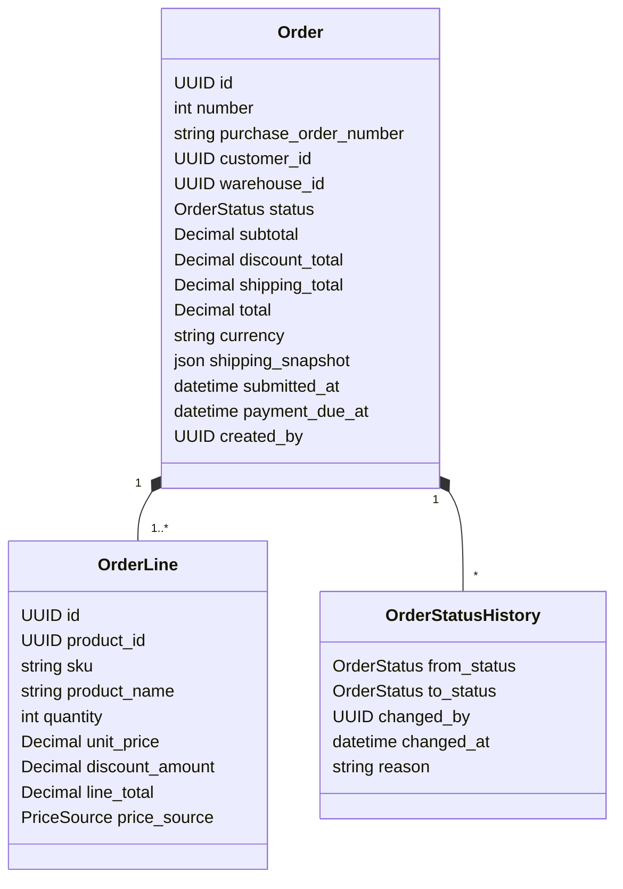
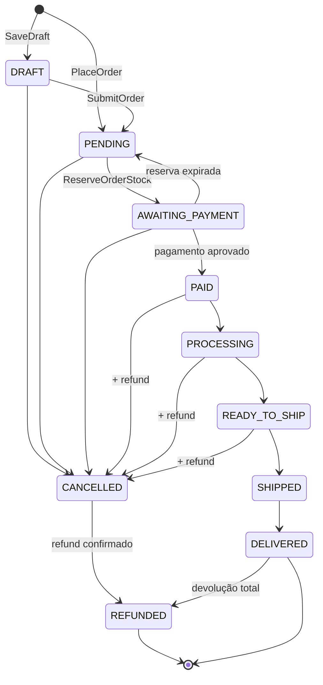

# Domínio: Orders (Pedidos)

> Fonte da verdade das regras de pedidos. Phase 6 implementou rascunho, submissão (`PENDING`),
> cancelamento antes do pagamento, numeração, preços congelados e idempotência; reserva (Phase 7),
> pagamento (Phase 8) e envio (Phase 9) completam o fluxo. Ver [Implementação](#implementação-phase-6).

## Responsabilidade

O módulo `orders` é dono do **ciclo de vida do pedido** e atua como coordenador (process manager)
do fluxo comercial: ele chama `customers`, `catalog`, `pricing`, `inventory`, `payments` e
`shipping` através das respectivas camadas `application`. Ele **não** decide preço (pricing),
disponibilidade de estoque (inventory) nem aprovação de pagamento (payments) — apenas orquestra e
aplica as regras de estado do pedido.

## Modelo

- `OrderLine` guarda um **snapshot** (sku, nome, preço unitário) no momento da submissão: alterações
  posteriores no catálogo ou nos preços não alteram pedidos existentes.
- MVP: um pedido é atendido por **um** depósito (`warehouse_id`). Multi-depósito é evolução futura.
- Impostos (ICMS, IPI etc.) estão **fora do escopo do MVP**; registrado em questões em aberto.

## Estados

| Estado | Significado |
| --- | --- |
| `DRAFT` | Rascunho editável; sem preço congelado; sem reserva |
| `PENDING` | Submetido e validado, preços congelados, **sem reserva de estoque ativa** |
| `AWAITING_PAYMENT` | Estoque reservado; aguardando pagamento até `payment_due_at` |
| `PAID` | Pagamento aprovado; reserva confirmada (não expira mais) |
| `PROCESSING` | Separação em andamento no depósito |
| `READY_TO_SHIP` | Separado e embalado; aguardando coleta |
| `SHIPPED` | Despachado; estoque baixado (`SALE`) |
| `DELIVERED` | Entregue ao cliente |
| `CANCELLED` | Encerrado antes do envio |
| `REFUNDED` | Valor pago devolvido ao cliente (cancelamento de pedido pago ou devolução total) |

### Transições permitidas

| De | Para | Use case | Condições / efeitos |
| --- | --- | --- | --- |
| — | `DRAFT` | `SaveDraft` | Cliente ativo |
| — / `DRAFT` | `PENDING` | `PlaceOrder` / `SubmitOrder` | Cliente ativo, produtos ativos, ≥ 1 linha, quantidades > 0; preços calculados por `pricing` e congelados |
| `PENDING` | `AWAITING_PAYMENT` | `ReserveOrderStock` | `inventory` reserva **todas** as linhas (tudo-ou-nada); define `payment_due_at` |
| `AWAITING_PAYMENT` | `PAID` | `PayOrder` | Pagamento aprovado; reserva passa a `CONFIRMED` |
| `AWAITING_PAYMENT` | `PENDING` | `ExpireUnpaidOrder` | `payment_due_at` vencido; reserva liberada (`EXPIRED`) |
| `PAID` | `PROCESSING` | `StartPicking` | Permissão `orders:process` |
| `PROCESSING` | `READY_TO_SHIP` | `CompletePicking` | — |
| `READY_TO_SHIP` | `SHIPPED` | `ShipOrder` | Reserva consumida (`SALE`); `Shipment` criado |
| `SHIPPED` | `DELIVERED` | `ConfirmDelivery` | Confirmação do provedor ou manual |
| `DRAFT`, `PENDING`, `AWAITING_PAYMENT` | `CANCELLED` | `CancelOrder` | Libera reserva se houver; motivo obrigatório |
| `PAID`, `PROCESSING`, `READY_TO_SHIP` | `CANCELLED` | `CancelOrder` | Libera reserva **e** solicita refund total; permissão `orders:cancel_paid` |
| `CANCELLED` | `REFUNDED` | `MarkOrderRefunded` | Somente se houve pagamento aprovado; ao receber `PaymentRefunded` |
| `DELIVERED` | `REFUNDED` | `CompleteReturn` | Devolução total recebida e refund confirmado |

Qualquer transição fora desta tabela levanta `InvalidOrderTransition` (`409 INVALID_ORDER_TRANSITION`).
Exemplos proibidos: `DELIVERED → PENDING`, `SHIPPED → CANCELLED` (após envio, apenas devolução),
`CANCELLED → PAID`, `REFUNDED → *`.

Estados terminais: `DELIVERED` (salvo devolução), `CANCELLED` sem pagamento, `REFUNDED`.

### Implementação da máquina de estados

- `OrderStateMachine` (domínio) contém a tabela acima como dado (`dict[OrderStatus, set[OrderStatus]]`)
  e expõe `can_transition(from, to)` e `assert_transition(from, to)`.
- Pattern **State** em forma de tabela de transições: suficiente porque o comportamento por estado
  é "quais transições são válidas". Classes por estado só se surgir comportamento que varie por
  estado além disso (registrar a decisão).
- Toda transição grava `OrderStatusHistory` e é feita com o pedido bloqueado
  (`select_for_update`) dentro da transação do use case.

## Invariantes

| # | Invariante | Garantida em |
| --- | --- | --- |
| O1 | Pedido não-rascunho tem ≥ 1 linha | domínio |
| O2 | `quantity > 0` em toda linha | domínio + CHECK |
| O3 | `unit_price >= 0`, `discount_amount >= 0`, `discount_amount <= quantity * unit_price` | domínio + CHECK |
| O4 | `line_total = quantity * unit_price - discount_amount` | domínio (calculado, não aceito do cliente) |
| O5 | `subtotal = Σ line_total`; `total = subtotal - discount_total + shipping_total`; `total >= 0` | domínio + CHECK `total >= 0` |
| O6 | Linhas e preços são imutáveis a partir de `PENDING` | domínio (API não expõe edição) |
| O7 | `number` único **na organização**, sequencial e sem lacunas; atribuído na submissão | UNIQUE (`organization_id`, `number`) + contador com lock |
| O8 | Um mesmo produto aparece no máximo uma vez por pedido | UNIQUE (`order_id`, `product_id`) |
| O9 | Toda mudança de status tem registro em `OrderStatusHistory` | application (mesma transação) |
| O10 | Status só muda pela máquina de estados | domínio + revisão (`domain-reviewer`) |

Arredondamento: valores monetários com 2 casas, `ROUND_HALF_UP`, aplicados por `Money` em
`shared/domain` — um único ponto de quantização.

## Casos de uso

| Use case | Endpoint | Permissão | Idempotente | Eventos |
| --- | --- | --- | --- | --- |
| `PlaceOrder` | `POST /api/v1/orders` | `orders:create` | `Idempotency-Key` | `OrderCreated`, `StockReserved` |
| `SaveDraft` / `UpdateDraft` | `POST /api/v1/orders/drafts`, `PATCH /api/v1/orders/{id}` | `orders:create` | — | — |
| `SubmitOrder` | `POST /api/v1/orders/{id}/submit` | `orders:create` | por estado | `OrderCreated`, `StockReserved` |
| `ReserveOrderStock` | `POST /api/v1/orders/{id}/reserve` | `orders:create` | por estado | `StockReserved` |
| `PayOrder` | `POST /api/v1/orders/{id}/pay` | `payments:create` | `Idempotency-Key` | `PaymentApproved`/`PaymentFailed`, `OrderPaid` |
| `CancelOrder` | `POST /api/v1/orders/{id}/cancel` | `orders:cancel` (+ `orders:cancel_paid`) | por estado | `OrderCancelled`, `StockReleased` |
| `StartPicking` | `POST /api/v1/orders/{id}/start-picking` | `orders:process` | por estado | `OrderStatusChanged` |
| `CompletePicking` | `POST /api/v1/orders/{id}/complete-picking` | `orders:process` | por estado | `OrderStatusChanged` |
| `ShipOrder` | `POST /api/v1/orders/{id}/ship` | `orders:ship` | por estado | `OrderShipped` |
| `ConfirmDelivery` | `POST /api/v1/orders/{id}/deliver` | `orders:ship` | por estado | `OrderDelivered` |
| `ExpireUnpaidOrder` | Celery Beat | sistema | por estado | `StockReservationExpired` |
| `CancelStalePendingOrders` | Celery Beat | sistema | por estado | `OrderCancelled` |

"Idempotente por estado": repetir a ação sobre um pedido que já está no estado de destino retorna o
pedido atual (200) sem novo efeito; a partir de outro estado retorna `409 INVALID_ORDER_TRANSITION`.

## Fluxo principal: `PlaceOrder`

Uma única transação (curta, sem chamadas externas):

1. Validar cliente ativo (`customers.application`).
2. Validar produtos ativos e carregar snapshot (`catalog.application`).
3. Calcular preços e descontos (`pricing.application` → `PricingStrategy` do cliente).
4. Criar `Order` (`PENDING`) + `OrderLine`s + `OrderStatusHistory` (`— → PENDING`).
5. Reservar estoque de todas as linhas (`inventory.application.ReserveStock`, ADR-008).
6. Transicionar para `AWAITING_PAYMENT`, definir `payment_due_at = reservation.expires_at`.
7. Publicar `OrderCreated` e `StockReserved` (despacho após commit).
8. Gravar resposta no registro de idempotência (ADR-012) e commit → `201 Created`.

Estoque insuficiente em qualquer linha → rollback total, `409 INSUFFICIENT_STOCK` com
`details.lines = [{product_id, requested, available}]`; nenhum pedido é criado.

## Fluxo de pagamento: `PayOrder`

A chamada ao gateway **não** acontece dentro de transação com locks:

1. **Tx 1**: bloquear pedido, exigir `AWAITING_PAYMENT`, criar `Payment(PENDING)` (idempotente).
2. **Fora de transação**: `PaymentGateway.charge(...)` com a chave de idempotência do pagamento.
3. **Tx 2**: bloquear pedido e pagamento; registrar o resultado:
   - aprovado e pedido ainda `AWAITING_PAYMENT` → `PAID`, reserva `CONFIRMED`, `OrderPaid`;
   - aprovado mas pedido **já não** está `AWAITING_PAYMENT` (reserva expirou nesse intervalo) →
     tentar reservar de novo; se conseguir → `PAID`; senão → pedido permanece `PENDING`,
     refund automático solicitado, notificação ao responsável;
   - recusado → `Payment(FAILED)`, `PaymentFailed`; pedido continua `AWAITING_PAYMENT` (nova
     tentativa permitida até `payment_due_at`).
4. Timeout/indisponibilidade do gateway → `Payment` permanece `PENDING`; task de reconciliação
   consulta o gateway com backoff e conclui o passo 3. A API responde `202 Accepted`.

## Fluxos alternativos

- **Pagamento recusado**: ver acima; após `payment_due_at`, a reserva expira normalmente.
- **Reserva expirada** (`ExpireUnpaidOrder`, Celery Beat a cada minuto): pedido volta para
  `PENDING` sem reserva; usuário pode tentar `reserve` novamente ou cancelar. Pedidos `PENDING`
  sem atividade por `ORDER_PENDING_MAX_AGE` (padrão 7 dias) são cancelados automaticamente com
  motivo `PENDING_TIMEOUT`.
- **Cancelamento de pedido pago**: `CANCELLED` imediato, reserva liberada, refund solicitado a
  `payments`; quando `PaymentRefunded` chega, `CANCELLED → REFUNDED`. Falha no refund fica visível
  no módulo `payments` para tratamento pelo time financeiro (o pedido continua `CANCELLED`).
- **Devolução** (pós-entrega): `OrderReturn` registra itens devolvidos; mercadoria aceita gera
  movimento `RETURN` no estoque; MVP trata devolução **total** (`DELIVERED → REFUNDED`).
  Devolução parcial é evolução futura.
- **Erro de processamento / integração indisponível**: operações síncronas falham sem estado
  parcial (rollback); operações assíncronas re-tentam com backoff e, ao esgotar, registram falha
  permanente para reprocessamento.

## Eventos

| Evento | Quando | Payload principal | Consumidores |
| --- | --- | --- | --- |
| `OrderCreated` | `PlaceOrder`/`SubmitOrder` concluído | `order_id`, `number`, `customer_id`, `total` | audit, notifications, analytics |
| `OrderPaid` | pedido → `PAID` | `order_id`, `payment_id`, `amount` | audit, notifications |
| `OrderCancelled` | pedido → `CANCELLED` | `order_id`, `previous_status`, `reason`, `refund_required` | audit, notifications |
| `OrderStatusChanged` | qualquer transição | `order_id`, `from`, `to`, `changed_by` | audit |
| `OrderShipped` | pedido → `SHIPPED` | `order_id`, `shipment_id`, `tracking_code` | notifications, audit |
| `OrderDelivered` | pedido → `DELIVERED` | `order_id`, `delivered_at` | notifications, audit |

## Implementação (Phase 6)

### O que existe nesta fase

| Use case | Transição | Observação |
| --- | --- | --- |
| `SaveDraft` | — → `DRAFT` | cliente ativo; linhas, depósito e endereço opcionais |
| `UpdateDraft` | `DRAFT` (edição) | substitui campos e linhas; recota os preços (estimativa) |
| `SubmitOrder` | `DRAFT → PENDING` | revalida tudo, **recota e congela** preços, numera, copia o endereço |
| `PlaceOrder` | — → `PENDING` | mesmo resultado do rascunho + submissão numa chamada; exige `Idempotency-Key` |
| `CancelOrder` | `DRAFT`/`PENDING → CANCELLED` | motivo obrigatório; estados pagos ficam para a Phase 8 (exigem refund) |
| `QuoteOrder` | — (leitura) | prévia de preços e totais calculados **pelo mesmo código** do pedido |

A máquina de estados já contém a tabela completa acima: as transições das fases seguintes só ganham
use cases, a tabela não muda.

### Decisões

- **Numeração.** `number` é inteiro, por organização, atribuído na **submissão** (rascunho não
  consome número). Um contador por organização (`OrderNumberSequence`) é incrementado com a linha
  bloqueada; como o incremento faz parte da transação do pedido, um rollback devolve o número —
  sem lacunas. Custo: submissões da mesma organização se enfileiram nesse contador durante a
  transação, aceitável para o volume B2B (ver ADR-008 para o mesmo raciocínio sobre locks curtos).
- **Preço é estimativa até a submissão.** O rascunho é recotado a cada edição; a submissão recota
  de novo e congela `unit_price`, `price_source`, `sku` e `product_name`.
- **Total esperado (`expected_total`).** A submissão e o `PlaceOrder` aceitam o total que a pessoa
  viu. Se a recotação der outro valor (tabela alterada entre a prévia e o envio), o pedido **não**
  é submetido: `409 PRICES_CHANGED` com `details.expected` e `details.actual`. Mesmo raciocínio do
  `expected_on_hand` no ajuste de estoque: ninguém confirma um valor que não viu.
- **Endereço de entrega.** Escolhido entre os endereços do cliente (padrão: o de entrega padrão).
  Na submissão o pedido grava uma **cópia** (`shipping_snapshot`); editar ou remover o endereço do
  cliente depois não altera o pedido (regra AD4 de `customers.md`).
- **Depósito.** Escolhido no pedido (obrigatório na submissão) e guardado para a reserva da Phase 7.
- **Nº do pedido de compra do cliente** (`purchase_order_number`): referência B2B opcional, livre.
- **Eventos.** `OrderCreated`/`OrderCancelled` passam a ser publicados quando existir o primeiro
  consumidor (reserva na Phase 7, notificações na Phase 10, auditoria na Phase 12). Construir o
  barramento sem consumidor seria infraestrutura especulativa; o `OrderStatusHistory` já registra
  toda transição de forma transacional.
- **Histórico append-only.** Como `StockMovement`, `OrderStatusHistory` rejeita `UPDATE`/`DELETE`
  por trigger no banco.

### Concorrência

| Situação | Proteção |
| --- | --- |
| Duas submissões do mesmo rascunho | pedido bloqueado (`select_for_update`); a segunda vê `PENDING` e responde 200 sem efeito (idempotente por estado) |
| Edição do rascunho durante a submissão | mesmo lock: a edição espera e então recebe `409 ORDER_NOT_EDITABLE` |
| Submissões simultâneas de pedidos diferentes | contador bloqueado: números distintos e contíguos |
| `POST /orders` repetido (rede, duplo clique) | `Idempotency-Key` (ADR-012): mesma resposta, um pedido só |

### Endpoints

| Endpoint | Permissão |
| --- | --- |
| `GET /api/v1/orders?status=&search=&customer=` · `GET /{id}` | `orders:read` |
| `POST /api/v1/orders` (`Idempotency-Key`) | `orders:create` |
| `POST /api/v1/orders/drafts` · `PATCH /{id}` · `POST /{id}/submit` | `orders:create` |
| `POST /api/v1/orders/quote` | `orders:create` |
| `POST /api/v1/orders/{id}/cancel` | `orders:cancel` |

## Erros de domínio

| Código | HTTP | Quando |
| --- | --- | --- |
| `INVALID_ORDER_TRANSITION` | 409 | Transição não permitida |
| `INSUFFICIENT_STOCK` | 409 | Alguma linha sem disponibilidade |
| `STOCK_BUSY` | 409 | Timeout de lock de estoque (re-tentável) |
| `CUSTOMER_INACTIVE` | 422 | Cliente bloqueado/inativo |
| `PRODUCT_UNAVAILABLE` | 422 | Produto inativo |
| `EMPTY_ORDER` | 422 | Pedido sem linhas |
| `INVALID_QUANTITY` | 422 | Quantidade menor que 1 (`details.product_ids`) |
| `PRICE_NOT_FOUND` | 422 | Produto sem preço para o cliente (`pricing.md`) |
| `PRICES_CHANGED` | 409 | `expected_total` diferente do total recotado |
| `ORDER_NOT_EDITABLE` | 409 | Edição de pedido que não é rascunho (O6) |
| `ADDRESS_REQUIRED` / `ADDRESS_NOT_AVAILABLE` | 422 | Sem endereço / endereço que não é do cliente |
| `WAREHOUSE_REQUIRED` / `WAREHOUSE_NOT_AVAILABLE` | 422 | Sem depósito / depósito inexistente ou inativo |
| `CANCEL_REASON_REQUIRED` | 422 | Cancelamento sem motivo |
| `DUPLICATE_ORDER_LINE` | 422 | Produto repetido no pedido |
| `ORDER_NOT_AWAITING_PAYMENT` | 409 | Pagamento em pedido fora de `AWAITING_PAYMENT` |
| `PAYMENT_DECLINED` | 422 | Gateway recusou o pagamento (pedido segue `AWAITING_PAYMENT`) |
| `IDEMPOTENCY_KEY_REQUIRED` / `_REUSED` / `_REQUEST_IN_PROGRESS` | 400 / 422 / 409 | ADR-012 |

## Questões em aberto

- Limite de crédito do cliente B2B e aprovação comercial antes de `PENDING`.
- Impostos brasileiros e emissão de nota fiscal (fora do MVP).
- Devolução parcial e refund parcial.
